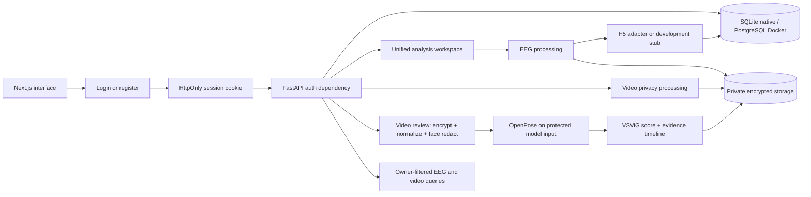

# MDS01

A research prototype with one shared analysis entry point and one separate privacy utility:

- **Unified analysis:** open **New analysis** and upload one EEG archive, one separate video, or both. EEG follows `privacy → configured inference adapter → report`; the demo defaults to a development stub, while H5 inference is opt-in. Video sends the same full-frame-blurred protected frames to Lightweight OpenPose and VSViG before presenting a privacy-safe evidence review. A paired upload has one status page with links to both modality reviews.
- **Video privacy:** upload a video and apply full-frame blur to every frame before reviewing/downloading the encrypted protected output. Face-detection coverage is a quality signal, not a selective blur mask. The retained output is audio-free; the encrypted source may contain audio while queued and is deleted during cleanup. Video never enters the EEG model.
- **Video detection:** authenticated VSViG review with full-frame-blurred pose/model input, privacy-safe protected playback, window scores, flagged intervals, and bounded model-input sensitivity. The pinned contract requires 1920×1080 input by default; smaller inputs need explicit operator-approved letterbox adaptation. The default Docker command initializes and verifies the named model volume; the service fails closed if its reviewed contract is unavailable.

Model output is **not a diagnosis**. Privacy transforms do not guarantee anonymity.

## Start on your laptop

Choose one backend profile. Docker is the reproducible team path; native mode is the lighter single-laptop prototype path.

### Docker

Only **Docker Desktop** (Linux containers), **Node.js 22 or newer** (with npm),
and internet access for the first image/model-asset setup are required. Start
Docker and run this one command from the repository root:

```sh
node scripts/demo.mjs
```

The launcher prepares local secrets without printing them, installs frontend
dependencies if they are missing, builds/starts Docker services, waits for the
backend health check, and starts the browser UI. Open
[MDS01](http://127.0.0.1:3000) or [API documentation](http://127.0.0.1:8000/docs).
Press Ctrl-C to stop the frontend; Docker services and data remain running.
Use `docker compose down` to stop the services without deleting their volumes.
The first Docker run can take longer while the pinned model bundle is installed
and verified.

You still need to sign in or create a local account and select data you are
permitted to use. The launcher does not upload data, guess EEG/video matches,
or claim synchronization. It does not bypass the strict input/pose gates.
The default EEG runtime is a development stub, so its scores are not real model
predictions. See [presentation readiness](docs/presentation-readiness.md) for
current demo limitations.
Existing `.env` runtime choices are preserved across repeat setup. New local
installations use `AUTH_MODE=local-accounts`: register the first
teammate in the browser, then sign in. Ordinary accounts see only their own EEG
sessions, upload drafts and video jobs; the development-only demo administrator
has read-only cross-owner review access. Use `AUTH_MODE=local` only for explicit
unauthenticated backend tests.
For H5 scores, waveform preview, sample data, Windows instructions and troubleshooting, see [setup](docs/setup.md).
For a request-by-request explanation of backend modules and services, see
[backend services explained](docs/backend-services.md).
For the official VSViG/pose bundle, video input contract, privacy lifecycle and
presentation checklist, see [video detection](docs/video-detection.md).

### Native prototype (no Docker)

Install Python 3.12, Node.js 22+, and FFmpeg. From the repository root:

```sh
node scripts/setup.mjs
python3.12 -m venv .venv
.venv/bin/python -m pip install -r backend/requirements-dev.txt
node scripts/start-native.mjs
```

In another terminal:

```sh
cd frontend
npm ci
npm run dev
```

Native mode uses SQLite at `backend/database/eeg.db` and encrypted files under
`backend/storage/`. It is intended for one laptop and low-volume prototype
work. The VSViG model dependencies are platform-sensitive; use the default
Docker Compose runtime for the real VSViG path unless your host installation
has been independently verified. The native runner automatically applies `.env`, runs Alembic,
and starts FastAPI with reload.

## How it fits together



| Location                                       | Responsibility                                           |
| ---------------------------------------------- | -------------------------------------------------------- |
| `frontend/src/app/`                            | Routes and shared layout                                 |
| `frontend/src/components/`                     | Screens, waveform/timeline views, UI primitives          |
| `frontend/src/lib/`                            | API adapter, view-model types, formatting                |
| `backend/app/api/`                             | HTTP validation and responses                            |
| `backend/app/services/`                        | Upload, processing, storage and cleanup                  |
| `backend/app/eeg/`, `privacy/`, `ml/`          | Model inputs, privacy transforms, inference              |
| `backend/app/video_privacy/`                   | Standalone video transforms                              |
| `backend/app/video_detection/`                 | Validated VSViG/pose assets, preprocessing and inference |
| `backend/app/database/`, `backend/migrations/` | Persistence and schema history                           |
| `backend/app/research/`, `backend/scripts/`    | Offline evaluation and calibration                       |
| `scripts/`                                     | Local setup and its safety test                          |

## Documentation

Use the [documentation map](docs/README.md) to find the one guide relevant to
your task. It separates runnable setup and architecture from supporting
research and security records. The operator-mounted H5 contract currently has
no active calibrators; the EEG confidence document is background, not a
performance claim.

## Repository hygiene

Commit source, tests, migrations and the frontend package lock. Keep `.env`, patient data, ZIP/RAR uploads, encrypted storage, generated reports, model weights/contracts and model backgrounds local-only. Store real patient data **outside the repository**.

`.dockerignore` limits builds to backend source; the H5 and VSViG bundles are
operator-managed named volumes mounted read-only at runtime. `.gitignore`
excludes common private artifacts. Neither
replaces checking files before a commit. Agent skills under `.agents/` are
optional developer tooling; teammates do not need an AI editor or BMAD to run
this project.
