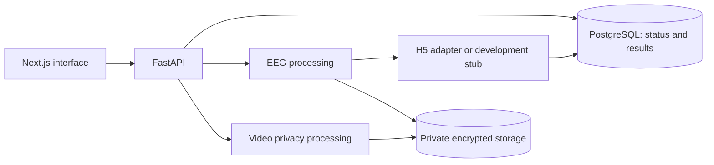

# MDS01

A research prototype with two independent workflows:

- **EEG analysis:** upload an EDF archive, apply privacy preprocessing, review window scores and flagged intervals.
- **Video privacy:** upload a video, choose face redaction or pose-only rendering, review and download protected output. Video never enters the EEG model.

Model output is **not a diagnosis**. Privacy transforms do not guarantee anonymity.

## Start on your laptop

Install **Docker Desktop** (Linux containers) and **Node.js 22 or newer**. Start Docker, clone this repository, and run from its root:

```sh
node scripts/setup.mjs
docker compose up --build
```

In a second terminal:

```sh
cd frontend
npm ci
npm run dev
```

Open [MDS01](http://127.0.0.1:3000) or [API documentation](http://127.0.0.1:8000/docs).
The setup command generates local secrets and leaves existing configuration untouched.
New installations use the deterministic **development stub**; existing `.env` runtime choices are preserved.
For H5 scores, waveform preview, sample data, Windows instructions and troubleshooting, see [setup](docs/setup.md).

## How it fits together



| Location | Responsibility |
| --- | --- |
| `frontend/src/app/` | Routes and shared layout |
| `frontend/src/components/` | Screens, waveform/timeline views, UI primitives |
| `frontend/src/lib/` | API adapter, view-model types, formatting |
| `backend/app/api/` | HTTP validation and responses |
| `backend/app/services/` | Upload, processing, storage and cleanup |
| `backend/app/eeg/`, `privacy/`, `ml/` | Model inputs, privacy transforms, inference |
| `backend/app/video_privacy/` | Standalone video transforms |
| `backend/app/database/`, `backend/migrations/` | Persistence and schema history |
| `backend/app/research/`, `backend/scripts/` | Offline evaluation and calibration |
| `scripts/` | Local setup and its safety test |

## Team reading order

1. [Setup and testing](docs/setup.md)
2. [Architecture and code ownership](docs/architecture.md)
3. [Frontend guide](docs/frontend.md) or [backend guide](docs/backend.md)
4. [Design rules](DESIGN.md)
5. [Privacy limitations](docs/privacy-research.md) and [deployment risks](docs/security-audit.md)

The [EEG confidence research](docs/eeg-viewing-and-confidence-research.md) records the rationale for per-window calibration. It is background material, not a claim that calibration has been fitted. The checked-in H5 contract currently has no active calibrators.

## Repository hygiene

Commit source, tests, migrations, the model contract and package lock. Keep `.env`, patient data, ZIP/RAR uploads, encrypted storage, generated reports and model backgrounds local-only. Store real patient data **outside the repository**.

`.dockerignore` limits builds to backend source and the supplied model; `.gitignore` excludes common private artifacts. Neither replaces checking files before a commit. Agent skills under `.agents/` are optional developer tooling; teammates do not need an AI editor or BMAD to run this project.
