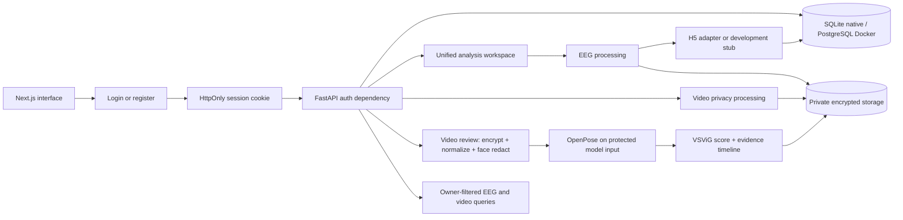

# MDS01

A research prototype with one shared analysis entry point and one separate privacy utility:

- **Unified analysis:** use **New patient review** at `/upload` to select one folder containing a supported EEG, a report, and video candidates. The folder flow extracts only draft name/hospital-ID candidates locally, requires human review, sends an EEG-only archive, and asks you to explicitly associate any video clip. Pairing never relies on filenames; synchronization is never assumed.
- **Video privacy:** upload a video and apply full-frame blur to every frame before reviewing/downloading the separate owner-only encrypted protected output and preview. Face-detection coverage is a quality signal, not a selective blur mask. The retained output is audio-free; the encrypted source may contain audio while queued and is deleted during cleanup. This preview is separate from video detection. Video never enters the EEG model.
- **Video detection:** authenticated VSViG review with full-frame-blurred pose/model input, privacy diagnostics, window scores, flagged intervals, and bounded model-input sensitivity. The validation visualization is transient and deleted; detection exposes no video or visualization preview. Only encrypted predictions and safe provenance are retained. Native 1920×1080 is the model geometry; the local H5 profile experimentally resizes smaller sources, records the source geometry and padding, and does not treat them as equivalent inputs. The Docker command initializes and verifies the named model volume; the service fails closed if its reviewed contract is unavailable.

Model output is **not a diagnosis**. Privacy transforms do not guarantee anonymity.

## Start on your laptop

Choose one backend profile. Docker is the reproducible team path; native mode is the lighter single-laptop prototype path.

### Docker

Only **Docker Desktop** (Linux containers), **Node.js 22 or newer** (with npm),
and internet access for the first image/model-asset setup are required. Start
Docker and run this from the repository root:

```sh
node scripts/demo.mjs
```

The launcher creates local configuration without printing secrets, installs
locked frontend dependencies when needed, builds and starts the H5 backend with
PostgreSQL and verified video assets, then opens the UI at
[MDS01](http://127.0.0.1:3000). The backend checks the exact local artifact and
reviewed contract at startup. Open the [API documentation](http://127.0.0.1:8000/docs).
Press Ctrl-C to stop the UI and `docker compose down` to stop containers while
preserving their data volumes. First startup can take longer while images and
pinned model assets are installed and verified.

To run the frontend and backend in separate terminals, use `npm run dev` for
the frontend and `docker compose up --build` for Docker. Press Ctrl-C in each
terminal to stop its process.

You still need to sign in or create a local account and select data you are
permitted to use. The setup commands do not upload data, guess EEG/video matches,
or claim synchronization. It does not bypass the strict input/pose gates.
H5 outputs are uncalibrated and non-diagnostic. To explicitly use the
development stub instead, run `docker compose -f docker-compose.yml up --build`;
those scores are development data, not model predictions. The tracked base
Compose file defaults to the stub; new setup-generated configuration explicitly
selects H5. If an existing `.env` sets `MODEL_RUNTIME=stub` but has no Compose
selection, setup adds the base Compose file and leaves the research profile
inactive. Legacy configs with no explicit runtime keep the H5 fallback. See the
[one-patient demo guide](docs/one-patient-research-demo.md) and
[presentation readiness](docs/presentation-readiness.md) for scope and
limitations.
`setup` preserves existing nonempty `MODEL_RUNTIME` and Compose values; it fills
only missing Compose selections using the runtime-specific defaults above. An
explicit local-research Compose selection activates H5 even if
`MODEL_RUNTIME=stub`. New local installations use `AUTH_MODE=local-accounts`:
register the first teammate in the browser, then sign in. Ordinary accounts see only their own EEG
sessions, upload drafts and video jobs; the development-only demo administrator
has read-only cross-owner review access. Use `AUTH_MODE=local` only for explicit
unauthenticated backend tests.
For H5 scores, waveform preview, sample data, Windows instructions and troubleshooting, see [setup](docs/setup.md).
For a request-by-request explanation of backend modules and services, see
[backend services explained](docs/backend-services.md).
For the official VSViG/pose bundle, video input contract, privacy lifecycle and
presentation checklist, see [video detection](docs/video-detection.md).

### Native prototype (no Docker)

Install Python 3.12, Node.js 22+, and FFmpeg. From the repository root:

```sh
node scripts/setup.mjs
python3.12 -m venv .venv
.venv/bin/python -m pip install -r backend/requirements-dev.txt
node scripts/start-native.mjs
```

In another terminal:

```sh
cd frontend
npm ci
npm run dev
```

Native mode uses SQLite at `backend/database/eeg.db` and encrypted files under
`backend/storage/`. It is intended for one laptop and low-volume prototype
work. The VSViG model dependencies are platform-sensitive; use the default
Docker Compose runtime for the real VSViG path unless your host installation
has been independently verified. The native runner automatically applies `.env`, runs Alembic,
and starts FastAPI with reload.

## How it fits together


```mermaid
flowchart LR
    Browser[Next.js interface] --> Auth[Login or register]
    Auth --> Cookie[HttpOnly session cookie]
    Cookie --> API[FastAPI auth dependency]
    API --> DB[(SQLite native / PostgreSQL Docker)]
    API --> Workspace[Unified analysis workspace]
    Workspace --> EEG[EEG processing]
    API --> Video[Video privacy processing]
    API --> Detection[Video review: encrypt + normalize + face redact]
    Detection --> Pose[OpenPose on protected model input]
    Pose --> VSViG[VSViG score + evidence timeline]
    VSViG --> Files
    EEG --> Model[H5 adapter or development stub]
    Model --> DB
    EEG --> Files[(Private encrypted storage)]
    Video --> Files
    API --> Owner[Owner-filtered EEG and video queries]
```

| Location                                       | Responsibility                                           |
| ---------------------------------------------- | -------------------------------------------------------- |
| `frontend/src/app/`                            | Routes and shared layout                                 |
| `frontend/src/components/`                     | Screens, waveform/timeline views, UI primitives          |
| `frontend/src/lib/`                            | API adapter, view-model types, formatting                |
| `backend/app/api/`                             | HTTP validation and responses                            |
| `backend/app/services/`                        | Upload, processing, storage and cleanup                  |
| `backend/app/eeg/`, `privacy/`, `ml/`          | Model inputs, privacy transforms, inference              |
| `backend/app/video_privacy/`                   | Standalone video transforms                              |
| `backend/app/video_detection/`                 | Validated VSViG/pose assets, preprocessing and inference |
| `backend/app/database/`, `backend/migrations/` | Persistence and schema history                           |
| `backend/app/research/`, `backend/scripts/`    | Offline evaluation and calibration                       |
| `scripts/`                                     | Local setup and its safety test                          |

## Documentation

Use the [documentation map](docs/README.md) to find the one guide relevant to
your task. It separates runnable setup and architecture from supporting
research and security records. The operator-mounted H5 contract currently has
no active calibrators; the EEG confidence document is background, not a
performance claim.

## Repository hygiene

Commit source, tests, migrations and the frontend package lock. Keep `.env`, patient data, ZIP/RAR uploads, encrypted storage, generated reports, model weights/contracts and model backgrounds local-only. Store real patient data **outside the repository**.

`.dockerignore` limits builds to backend source. The local H5 artifact and
reviewed contract are operator-supplied host files, bind-mounted read-only at
`/opt/eeg-model`; a named parent volume provides the mountpoint but does not
store those files. The VSViG bundle is initialized into its own named Docker
volume and mounted read-only. `.gitignore` excludes common private artifacts. Neither
replaces checking files before a commit. Agent skills under `.agents/` are
optional developer tooling; teammates do not need an AI editor or BMAD to run
this project.
