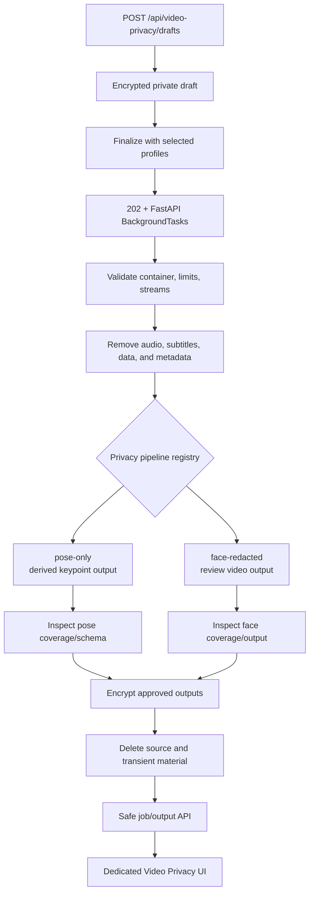
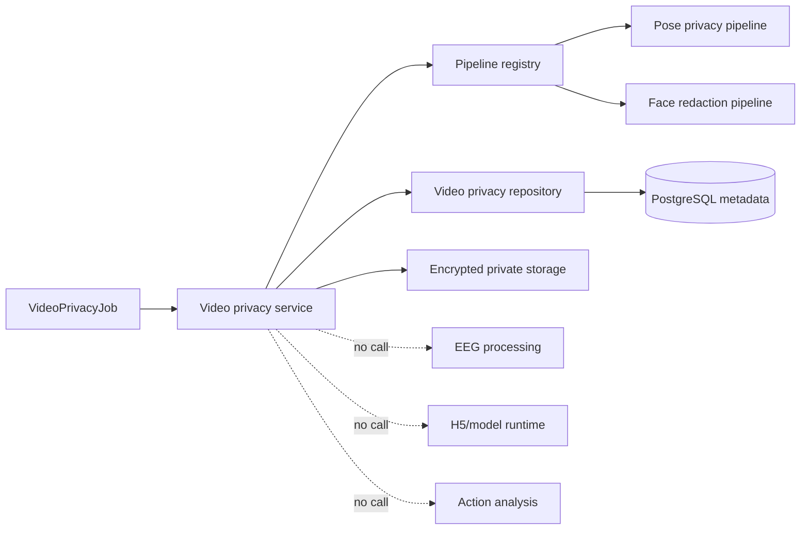

# Architecture diagrams

## Standalone video privacy flow

## System boundary

The public boundary is the safe job/output summary. The private boundary holds
encrypted drafts and approved derivatives only; it never turns the filesystem
into a public media endpoint.
