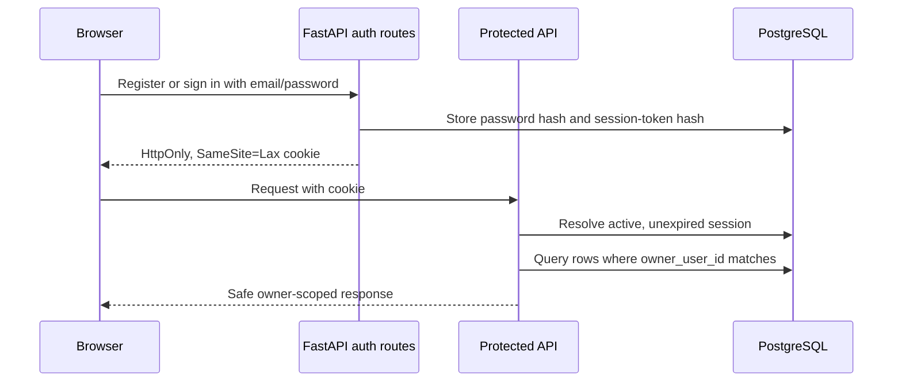
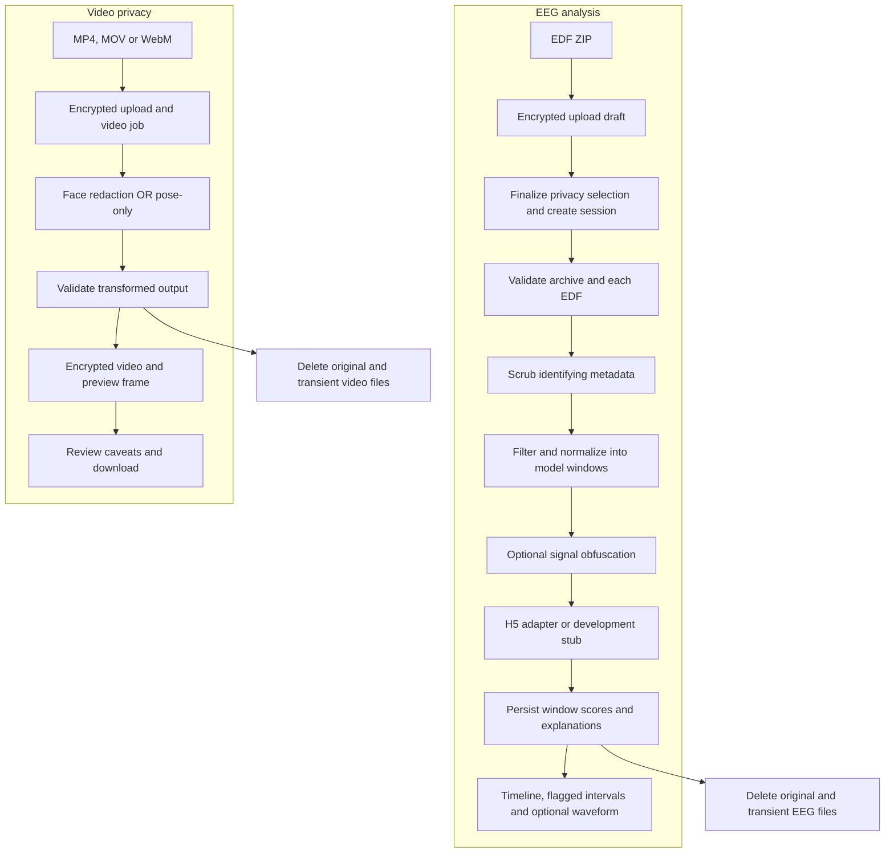
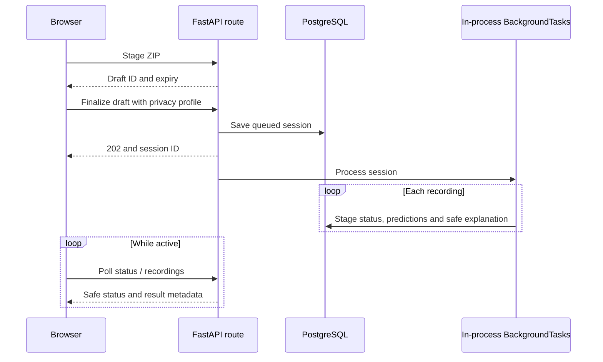
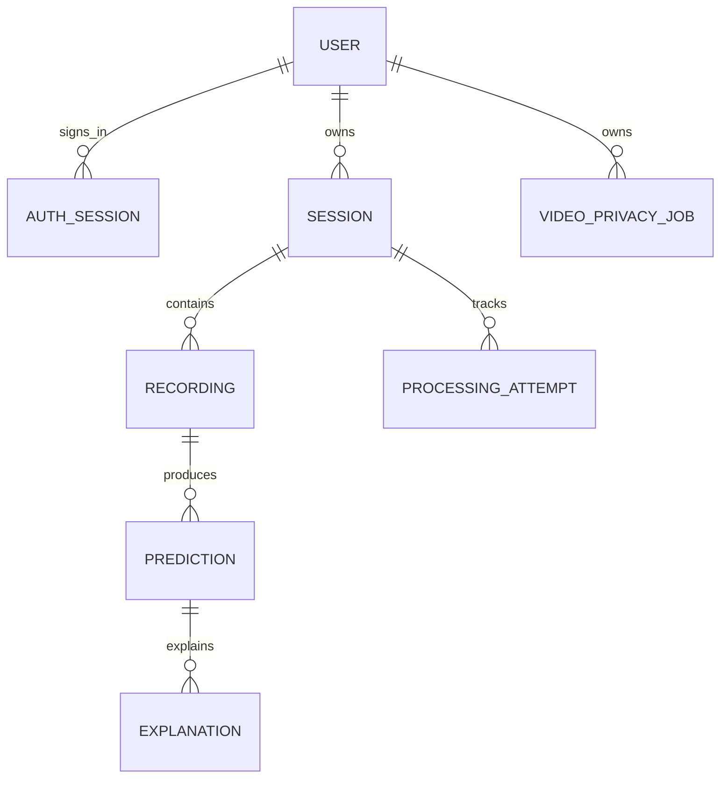

# Architecture

MDS01 has a browser interface, one FastAPI process, PostgreSQL and a private filesystem volume. EEG and video share infrastructure, not analysis pipelines.

## Authentication boundary

`GET /health` and `GET /api/auth/session` are public. In `local-accounts`,
all EEG/video routes require an active cookie and state-changing browser
requests require a configured `Origin`. `local` is an explicit unauthenticated
test mode. Cloudflare Access remains the remote-deployment path; its verified
subject is mapped to the same ownership table.

## Two independent workflows

One ZIP creates one session containing multiple recordings. A malformed recording can fail while its siblings complete. A video job accepts one profile; it does not run H5, seizure detection or action classification.

## Where to change code

| Change | Start here |
| --- | --- |
| Navigation and layout | `frontend/src/components/AppShell.tsx` |
| Session list / processing status | `DashboardScreen.tsx`, `SessionDetailScreen.tsx` |
| EEG result explanation | `ResultScreen.tsx`, `PredictionTimeline.tsx`, `SignalViewer.tsx` |
| Video upload / output review | `VideoPrivacyScreen.tsx` |
| Browser/backend mapping | `frontend/src/lib/api.ts`, `types.ts` |
| HTTP endpoints | `backend/app/api/` |
| EEG processing sequence | `backend/app/services/processing_service.py` |
| Video job sequence | `backend/app/services/video_privacy_service.py` |
| Video transformation | `backend/app/video_privacy/processor.py` |
| Input shape and preprocessing | `backend/app/eeg/model_input.py`, `preprocessing.py` |
| Runtime selection | `backend/app/ml/model_loader.py` |
| H5 artifact and score semantics | `backend/model/model-contract.json`, `backend/app/ml/h5_inference.py` |
| Database operations / schema changes | `backend/app/database/`, a new Alembic migration |

Keep route handlers small. Extend the service that already owns a workflow before adding another coordinator. Keep API calls in the existing browser adapter and use existing shadcn primitives and Hugeicons.

## Async request lifecycle

BackgroundTasks runs in the API process. Restarting it can interrupt work; there is no durable queue or automatic cross-process retry. Keep one worker for this prototype. A queue is a deployment change, not part of the current architecture.

## Data ownership and retention

Rows created before account ownership was enabled have `owner_user_id = null`
and are quarantined from normal account queries. They are not reassigned or
returned to a signed-in user.

Video jobs are independent rows; transformed video artifacts live in the filesystem. PostgreSQL stores status, safe result metadata and private internal artifact references. File bytes stay in private storage.

- EEG originals and intermediate files are deleted after processing. Default retention keeps encrypted transformed model-positive clips with configured context. Full transformed preview is an explicit local-only exception.
- Video keeps encrypted transformed output and a preview until expiry. Intermittent detection requires acknowledgement before download; no usable transform means no output.
- Public responses never return original files, client filenames, patient references, private paths or original metadata.
- Privacy keys are installation-specific. Changing or losing a key can make retained artifacts unreadable. Setup never overwrites existing keys.

## Model output is evidence for review

The reviewed input is 256 Hz, 18 configured bipolar channels, four-second windows, a two-second stride, and `(N, 1024, 18)` float32 tensors. The H5 adapter checks the artifact hash and contract at startup.

The UI distinguishes development scores, uncalibrated H5 scores and estimated **window** probabilities. The supplied contract currently has no active calibration profiles. Offline fitting and review are required before enabling probability language. No recording-level confidence is implemented; a peak score or flagged-window fraction is descriptive only.

Keep each profile's calibration/evaluation separate. The fixed research split is train `chb01–chb06`, calibration `chb07–chb08`, test `chb09–chb10`. This evaluator split does not establish the supplied model's original training provenance; review that before making held-out performance claims.

See [backend details](backend.md) for the API and research tools, [frontend details](frontend.md) for screen behavior, and [setup](setup.md) for runnable checks. Historical security and research reports are retained as evidence, not current validation certificates.
# Independent video detection

Video detection adds `VideoDetectionJob` (migration 015) alongside the existing EEG and privacy job tables. Its routes live under `/api/video-detection`; its service schedules an isolated CPU subprocess through FastAPI BackgroundTasks. [Video architecture and retention](video-detection.md#architecture-and-data-handling) describes encrypted inputs, owner-filtered playback, scoring and cleanup. There are no changes to the EEG model-input contract or EEG processing routes.
