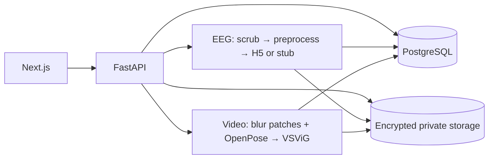

# How the app fits together

MDS01 has a Next.js browser app, a FastAPI backend, PostgreSQL, and private
encrypted file storage. Docker Compose runs PostgreSQL and FastAPI together;
the browser app runs with Node.js. The VSViG/OpenPose code runs inside FastAPI,
using a separately initialized, read-only Docker volume for its model assets.

EEG and video use separate inference paths. They share authentication, storage,
and the case workspace; the backend does not combine their model scores or
assume their timelines line up.

```mermaid
flowchart LR
    Browser[Next.js] --> API[FastAPI]
    API --> DB[(PostgreSQL)]
    API --> Files[(Encrypted private storage)]
    API --> EEG[EEG: scrub → preprocess → H5 or stub]
    API --> Video[Video: blur patches + OpenPose → VSViG]
    EEG --> DB
    Video --> DB
    EEG --> Files
    Video --> Files
```

## Main workflows

- **EEG:** upload archive → encrypt it → create an asynchronous session →
  validate and scrub each recording → build model windows → run H5 or the
  development stub → save results → remove originals and temporary files.
- **Video detection:** encrypt upload → normalize frames → extract pose from
  temporary source frames and image patches from blurred frames → run VSViG →
  retain encrypted predictions and a redacted review video until expiry.
- **Video privacy:** independently blurs video for protected review. It does
  not run VSViG or predict seizures.

The API schedules EEG/video jobs with in-process background work. A backend
restart can interrupt a job; there is no durable queue. Keep one backend
process for this prototype.

## Ownership and files

Authenticated routes scope jobs and results to the signed-in owner. PostgreSQL
stores users, job/session state, safe metadata, predictions, and internal file
references. Media bytes stay in encrypted files, never as database blobs.
Temporary plaintext used during processing is removed by cleanup. Changing or
losing the local encryption key can make retained files unreadable.

Public API responses do not reveal original names, patient references,
filesystem paths, or source media. The video review player exposes only its
owner-scoped, redacted output. See [setup](setup.md) before running the app and
[the video runbook](video-detection.md) for its separate model contract.

## Where code lives

| Responsibility | Location |
| --- | --- |
| Browser routes and screens | frontend/src/app/, frontend/src/components/ |
| Browser API adapter and types | frontend/src/lib/ |
| HTTP routes | backend/app/api/ |
| Workflow/business logic | backend/app/services/ |
| EEG parsing and tensor preparation | backend/app/eeg/, backend/app/privacy/, backend/app/ml/ |
| Video privacy transform | backend/app/video_privacy/ |
| VSViG/pose inference | backend/app/video_detection/ |
| Database models and queries | backend/app/database/ |
| Schema history | backend/migrations/versions/ |

Keep routes thin, put database queries in repositories, and add schema changes
as Alembic migrations. Read the [backend guide](backend.md) before changing EEG
processing or API behavior.
