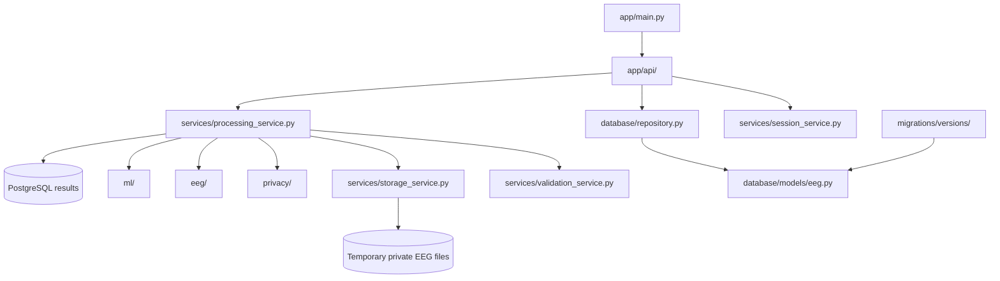
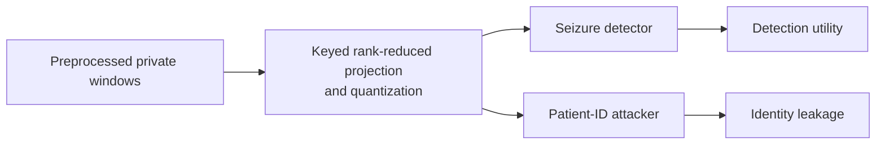
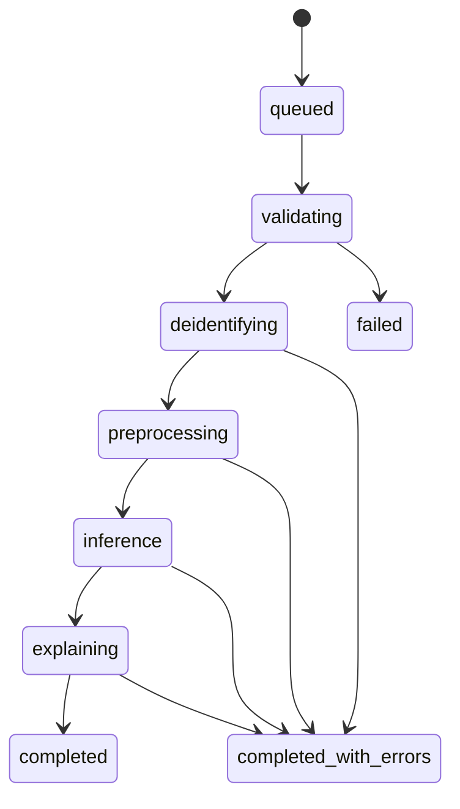
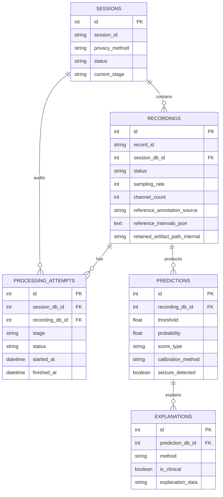

# Backend internals

The backend is a FastAPI application backed by PostgreSQL and private
session-scoped storage. Routes receive requests; services own the workflow;
repositories own database queries.



## Request and processing flow

```mermaid
flowchart TD
    Upload[POST /api/sessions/upload] --> Encrypt[Encrypt ZIP with AES-GCM]
    Encrypt --> Queue[Return 202 and schedule BackgroundTasks]
    Queue --> Validate[Validate archive and EDF files]
    Validate --> RecordLoop{Each recording independently}
    RecordLoop --> Scrub[Blank identifying EDF fields\nand annotation descriptions]
    Scrub --> Preprocess[Bandpass, notch, normalize, clip]
    Preprocess --> Windows[(N, 1024, 18) float32]
    Windows --> Method{Privacy method}
    Method --> Control[metadata-scrub\nPreserve waveform values]
    Method --> Transform[signal-obfuscation\nKeyed lossy projection]
    Control --> Detector[Inference adapter]
    Transform --> Detector
    Control --> PSD[PSD features for research evaluation]
    Transform --> PSD
    Detector --> Prediction[Prediction rows]
    Prediction --> Explanation[Non-clinical explanation JSON]
    Prediction --> Retain{Any model-positive windows?}
    Retain -->|yes| Clip[Expand 60 seconds, merge, encrypt clip]
    Retain -->|no| Delete[Delete recording temporary files]
    Clip --> SafeResults[Public result endpoints]
    Delete --> SafeResults
    RecordLoop -->|Malformed EDF| Failed[Mark one recording failed]
    Failed --> SafeResults
    SafeResults --> Cleanup[Delete full transient files and archive]
```

The projection method is intentionally shape-preserving so the same transformed
windows feed both downstream branches:



`metadata-scrub` performs metadata de-identification but does not change the
numeric signal. `signal-obfuscation` is experimental risk reduction, not a
formal anonymity guarantee. Encryption protects storage; neither encryption
nor metadata scrubbing removes every possible EEG biometric signal.

## Status lifecycle



`processing_attempts` records stage, status, start/end times, and bounded safe
errors. A failed recording does not stop its siblings.

## API surface

Sessions:

- `POST /api/sessions/upload`
- `GET /api/sessions`
- `GET /api/sessions/{session_id}`
- `GET /api/sessions/{session_id}/status`
- `GET /api/sessions/{session_id}/recordings`
- `DELETE /api/sessions/{session_id}` (completed sessions only)

Recordings:

- `GET /api/recordings/{record_id}`
- `GET /api/recordings/{record_id}/prediction`
- `GET /api/recordings/{record_id}/explanation`
- `GET /api/recordings/{record_id}/signal`

Responses expose generated IDs, safe technical metadata, statuses, processing
progress, recording-level model alert counts, predictions, safe relative CHB-MIT
reference intervals, and explanation JSON. Stub results expose a peak window
development score and score timeline, not model confidence or accuracy. A
whole-recording accuracy requires labelled evaluation data. Calibrated
probability is returned only when a reviewed model contract says calibration is
available.
Hidden macOS
archive entries such as `__MACOSX/._*.edf` are ignored before recording rows
are created. A direct recording response also includes its safe
owning `session_id`, `session_created_at`, and `privacy_method` so a recording
result can show when its upload was submitted. They do not expose patient
references, original names, filesystem paths, original files, or cryptographic
hashes.

## Database tables



Alembic owns schema changes. Add a new migration instead of changing old
migrations or using `create_all()` in the Docker runtime.

## Backend reading order

1. `app/main.py` — application and routers.
2. `app/api/sessions.py` — upload and session endpoints.
3. `app/services/processing_service.py` — the complete coordinator.
4. `app/services/storage_service.py` — encryption, extraction, cleanup.
5. `app/privacy/deidentify.py` — EDF metadata scrubbing.
6. `app/privacy/signal_projection.py` — shared research transformation and
   PSD attacker features.
7. `app/privacy/retention.py` — positive-window selection and clip creation.
8. `app/eeg/preprocessing.py` and `app/eeg/model_input.py` — model tensor.
9. `app/ml/` — stub and reviewed H5 adapter.
10. `app/database/models/eeg.py` and `app/database/repository.py` — persistence.
11. `migrations/versions/` — database history.
