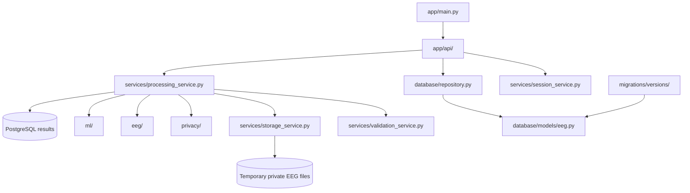
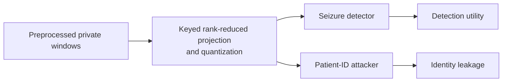
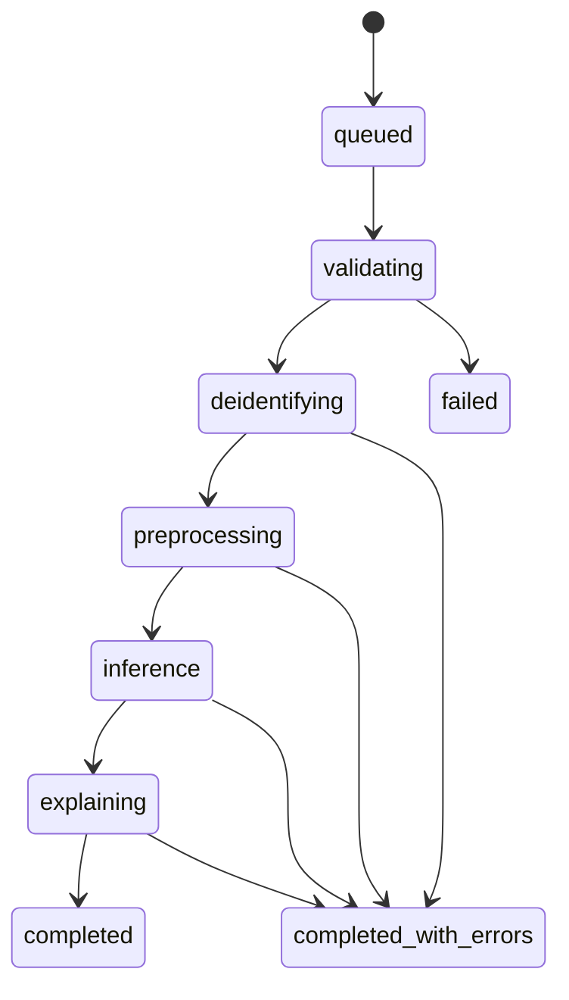
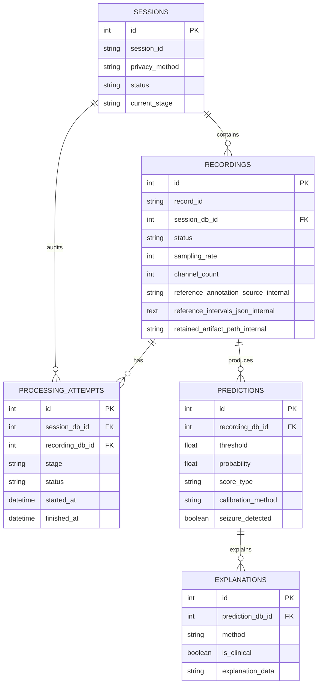

# Backend internals

The backend is a FastAPI application backed by PostgreSQL and private
session-scoped storage. Routes receive requests; services own the workflow;
repositories own database queries.



## Request and processing flow

```mermaid
flowchart TD
    Upload[POST /api/uploads/drafts] --> Encrypt[Encrypt ZIP with AES-GCM]
    Encrypt --> Draft[Return 201 draft_id and expiry]
    Draft --> Select[Select privacy method]
    Select --> Finalize[POST /api/uploads/drafts/{id}/finalize]
    Finalize --> Queue[Create session, return 202, schedule BackgroundTasks]
    Queue --> Validate[Validate archive and EDF files]
    Validate --> RecordLoop{Each recording independently}
    RecordLoop --> Scrub[Blank identifying EDF fields\nand annotation descriptions]
    Scrub --> Preprocess[Bandpass, notch, normalize, clip]
    Preprocess --> Windows[(N, 1024, 18) float32<br/>4s windows / 2s step]
    Windows --> Method{Privacy method}
    Method --> Control[metadata-scrub\nRequired baseline\nPreserve waveform values]
    Method --> Transform[metadata-scrub + signal-obfuscation\nOptional keyed lossy projection]
    Control --> Detector[Inference adapter]
    Transform --> Detector
    Control --> PSD[PSD features for research evaluation]
    Transform --> PSD
    Detector --> Prediction[Prediction rows]
    Prediction --> Explanation[Non-clinical explanation JSON]
    Prediction --> Retain{Any model-positive windows?}
    Retain -->|yes| Clip[Expand up to 10 minutes, merge, encrypt clip]
    Retain -->|no| Delete[Delete recording temporary files]
    Clip --> SafeResults[Public result endpoints]
    Delete --> SafeResults
    RecordLoop -->|Malformed EDF| Failed[Mark one recording failed]
    Failed --> SafeResults
    SafeResults --> Cleanup[Delete full transient files and archive]
    Legacy[POST /api/sessions/upload] -. compatibility .-> Queue
```

The projection method is intentionally shape-preserving so the same transformed
windows feed both downstream branches:



`metadata-scrub` performs metadata de-identification but does not change the
numeric signal. `signal-obfuscation` is experimental risk reduction, not a
formal anonymity guarantee. Encryption protects storage; neither encryption
nor metadata scrubbing removes every possible EEG biometric signal.

## H5 runtime boundary

Docker defaults to the supplied `best_seizure_model.h5` through the reviewed
H5 adapter. The research image is built as `linux/amd64` because the normal
Apple Silicon host environment may not provide the required TensorFlow wheel.
The adapter loads the model once, validates `(None, 1024, 18)` input and
`(None, 1)` sigmoid output, and runs batched float32 predictions.

The checked-in contract is reviewed for the supplied artifact, including its
hash, output semantics, threshold, and training preprocessing. If the H5 file
changes, rerun the verifier and set `reviewed` to false until the replacement
has been reviewed.
The H5 score is an uncalibrated research score. It must not be presented as
confidence, accuracy, or a clinical probability. The notebook's reported
metrics are also preliminary because its random window split allows adjacent
windows from the same recordings and patients to cross train/test boundaries.

The training notebook uses four-second windows with a two-second step. MDS01
keeps the input tensor unchanged but uses that same 50% overlap when generating
prediction windows. `signal-obfuscation` remains shape-compatible but needs a
separate utility evaluation because the H5 model was trained on the
preprocessed, non-obfuscated signal distribution.

## Privacy profile contract

Every upload is protected by encrypted storage and the required metadata scrub.
The optional signal transformation is selected as an ordered list:

```json
["metadata-scrub"]
```

or:

```json
["metadata-scrub", "signal-obfuscation"]
```

The database stores the compact canonical profile
`metadata-scrub` or `metadata-scrub+signal-obfuscation`. The legacy
`privacy_method` form field remains accepted for current canonical values;
historical names are migrated internally and are not returned by the public
API. “None” in the frontend means no optional signal transformation, never
that metadata protection or encrypted storage is disabled.

## Model alerts and timestamps

The model writes one prediction row per four-second window. A recording is
model-positive only when persisted rows have `seizure_detected=true`.
Optional `.edf.seizures` sidecars and summary files are stored only as private
research metadata; they cannot create, remove, count, color, retain, or label a
model alert.

Positive windows are merged when they overlap or touch. The public recording
response exposes the resulting recording-relative `alert_intervals`, for
example `3560–3576` seconds, plus the flagged-window count. The complete
prediction timeline covers the entire recording. Raw waveform access remains
restricted to bounded retained positive clips and is disabled by default.

## Offline accuracy and research attribution

Live uploads do not have trusted labels, so the routine API never reports an
accuracy percentage. The research evaluator is a separate command:

```bash
PYTHONPATH=. .venv/bin/python backend/scripts/evaluate_chb_mit.py /path/to/chbmit \
  --privacy-method metadata-scrub \
  --split test \
  --output reports/metadata-scrub.json \
  --plots reports/metadata-scrub.png
```

Run it again with
`--privacy-method metadata-scrub+signal-obfuscation` to measure the optional
transformation separately. The evaluator uses the fixed `chb01`–`chb10`
patient manifest, keeps patients disjoint between train/calibration/test
groups, and scores windows only after the recording has been assigned to a
split. `.edf.seizures` sidecars supply labels for this report only; they never
change a live alert. The JSON report includes confusion matrix, ROC/AUC,
precision-recall, sensitivity, specificity, precision, recall, F1, false
alarms per hour, calibration/Brier/ECE, threshold sweep, exclusions, and a
patient-level bootstrap interval.

SHAP attribution is an optional H5-only research feature. Generate the two
profile-specific backgrounds from calibration subjects `chb07` and `chb08`:

```bash
PYTHONPATH=. .venv/bin/python backend/scripts/create_shap_background.py \
  /path/to/chb-mit-scalp-eeg-database-1.0.0
```

The command creates the private, Git-ignored files
`backend/model/shap-background-metadata.npy` and
`backend/model/shap-background-obfuscated.npy`. Set
`ENABLE_SHAP_EXPLANATIONS=true` only after checking both are `(32, 1024, 18)`
`float32` tensors. The pipeline selects the background matching the final
privacy profile, explains at most the highest-scoring flagged windows, and
returns only channel-level and time-binned aggregates. Missing backgrounds or
SHAP errors fail closed to the normal score-only result. The UI labels this
output “Research attribution — not a clinical explanation.”

## Status lifecycle



`processing_attempts` records stage, status, start/end times, and bounded safe
errors. A failed recording does not stop its siblings.

## API surface

Sessions:

- `POST /api/sessions/upload`
- `GET /api/sessions`
- `GET /api/sessions/{session_id}`
- `GET /api/sessions/{session_id}/status`
- `GET /api/sessions/{session_id}/recordings`
- `DELETE /api/sessions/{session_id}` (completed sessions only)

Upload drafts:

- `POST /api/uploads/drafts`
- `GET /api/uploads/drafts/{draft_id}`
- `POST /api/uploads/drafts/{draft_id}/finalize`
- `DELETE /api/uploads/drafts/{draft_id}`

Recordings:

- `GET /api/recordings/{record_id}`
- `GET /api/recordings/{record_id}/prediction`
- `GET /api/recordings/{record_id}/explanation`
- `GET /api/recordings/{record_id}/signal`

Responses expose generated IDs, safe technical metadata, statuses, processing
progress, recording-level model alert counts, predictions, and explanation JSON.
Optional CHB-MIT sidecars are stored only as internal research metadata and are
never returned by normal API responses. Stub results expose a peak window
development score and score timeline, not model confidence or accuracy. A
whole-recording accuracy requires labelled evaluation data. Calibrated
probability is returned only when a reviewed model contract says calibration is
available. The signal route remains `404` unless local preview is explicitly
enabled; even then it only returns bounded retained model-positive clips.
Hidden macOS
archive entries such as `__MACOSX/._*.edf` are ignored before recording rows
are created. A direct recording response also includes its safe
owning `session_id`, `session_created_at`, and `privacy_method` so a recording
result can show when its upload was submitted. They do not expose patient
references, original names, filesystem paths, original files, or cryptographic
hashes.

## Video privacy boundary

Patient-video processing is a separate planned subsystem, not another EEG
recording stage. Its contract is documented in
[`_bmad-output/specs/spec-patient-video-deidentification/SPEC.md`](../_bmad-output/specs/spec-patient-video-deidentification/SPEC.md).
The intended flow is `video → selected privacy pipeline(s) → encrypted output`
with no H5 inference, action analysis, or clinical model call.

## Database tables



Alembic owns schema changes. Add a new migration instead of changing old
migrations or using `create_all()` in the Docker runtime.

## Backend reading order

1. `app/main.py` — application and routers.
2. `app/api/sessions.py` — upload and session endpoints.
3. `app/services/processing_service.py` — the complete coordinator.
4. `app/services/storage_service.py` — encryption, extraction, cleanup.
5. `app/privacy/deidentify.py` — EDF metadata scrubbing.
6. `app/privacy/signal_projection.py` — shared research transformation and
   PSD attacker features.
7. `app/privacy/retention.py` — positive-window selection and clip creation.
8. `app/eeg/preprocessing.py` and `app/eeg/model_input.py` — model tensor.
9. `app/ml/` — stub and reviewed H5 adapter.
10. `app/database/models/eeg.py` and `app/database/repository.py` — persistence.
11. `migrations/versions/` — database history.
