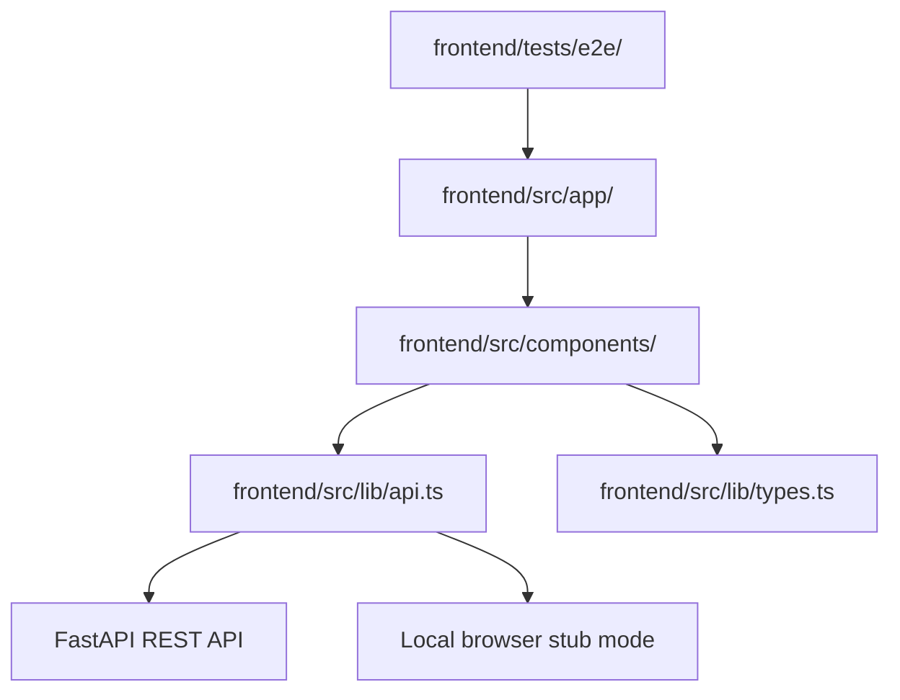
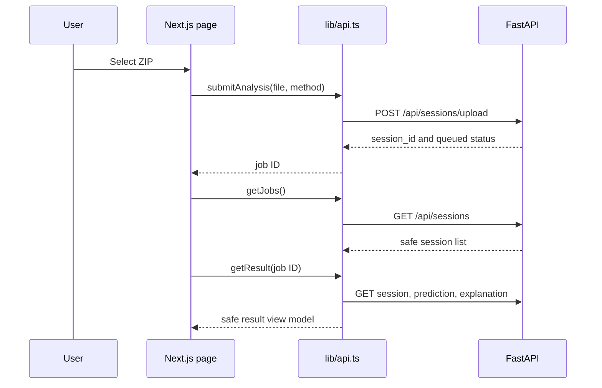
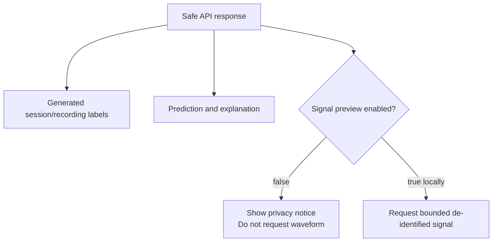

# Frontend internals

The frontend is a small Next.js App Router application. It owns screens and
browser state; the FastAPI backend owns sessions, processing, and results.

MDS01 is a research-only clinical decision-support prototype for clinicians and
clinical researchers. Its job is to make upload state, privacy handling, and
model output easy to inspect. It does not replace clinical judgment or claim
autonomous diagnosis.



## User journey

```mermaid
flowchart LR
    Upload[/upload] --> Submit[Choose ZIP and privacy method]
    Submit --> Dashboard[/dashboard]
    Dashboard --> Poll[Poll session status]
    Poll --> Results[/results/{jobId}]
    Results --> Prediction[Prediction and confidence]
    Results --> Explanation[Non-clinical explanation notice]
```

## Frontend-to-backend calls



The adapter uses local stub mode by default so the interface can be developed
without the backend. Set this in `frontend/.env.local` to use FastAPI:

```dotenv
NEXT_PUBLIC_USE_API_STUB=false
NEXT_PUBLIC_API_BASE_URL=http://127.0.0.1:8000
```

## Pages and components

- `src/app/upload/page.tsx` renders the upload route.
- `src/app/dashboard/page.tsx` renders submitted sessions and statuses.
- `src/app/results/[jobId]/page.tsx` renders one result.
- `src/components/UploadScreen.tsx` owns file selection and submission.
- `src/components/DashboardScreen.tsx` owns the job list and polling.
- `src/components/ResultScreen.tsx` owns prediction and explanation layout.
- `src/components/AttentionHeatmap.tsx` draws the optional local signal view.
- `src/components/AppShell.tsx` provides shared navigation and page frame.
- `src/lib/api.ts` is the only frontend-to-backend adapter.
- `src/lib/types.ts` defines the frontend view-model types.

## Privacy behavior in the UI



The frontend never displays patient references, original filenames, original
paths, or unrestricted original files. The signal request is not made when
preview is disabled.

## Frontend reading order

1. `src/app/layout.tsx` and `src/components/AppShell.tsx` — shared shell.
2. `src/app/upload/page.tsx` and `UploadScreen.tsx` — first user action.
3. `src/app/dashboard/page.tsx` and `DashboardScreen.tsx` — session polling.
4. `src/app/results/[jobId]/page.tsx` and `ResultScreen.tsx` — result review.
5. `src/lib/types.ts` — view-model contracts.
6. `src/lib/api.ts` — stub/backend switch and API calls.
7. `tests/e2e/mds01.spec.ts` — expected user-visible behavior.

The visual rules live in the root [`DESIGN.md`](../DESIGN.md). Keep new visual
work aligned with that file instead of adding another design system.
