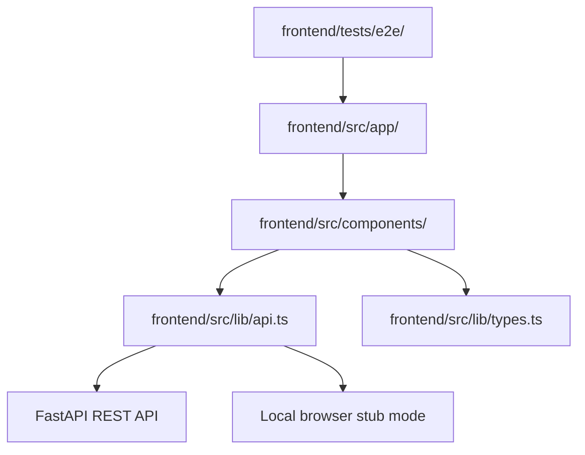
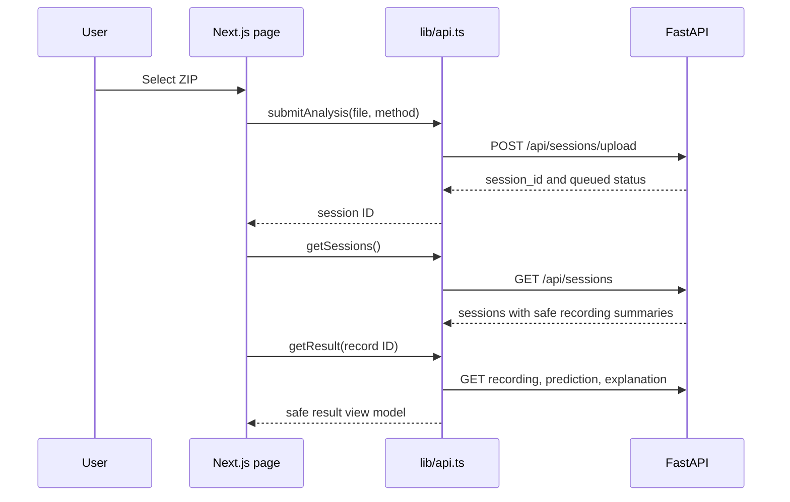
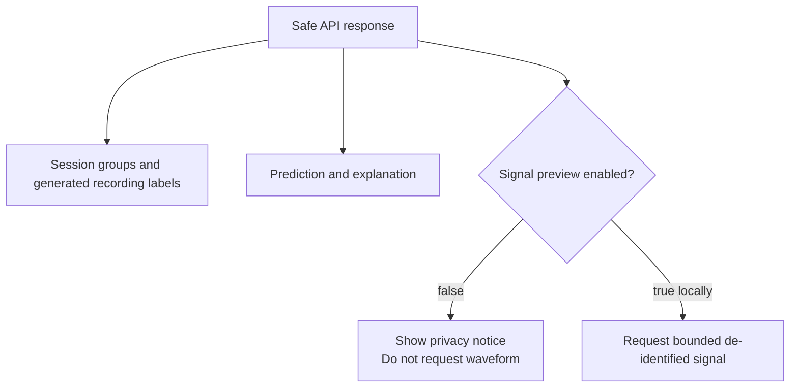

# Frontend internals

The frontend is a small Next.js App Router application. It owns screens and
browser state; the FastAPI backend owns sessions, processing, and results.

MDS01 is a research-only clinical decision-support prototype for clinicians and
clinical researchers. Its job is to make upload state, privacy handling, and
model output easy to inspect. It does not replace clinical judgment or claim
autonomous diagnosis.



## User journey

```mermaid
flowchart LR
    Upload[/upload] --> Submit[Choose ZIP and privacy method]
    Submit --> Session[/sessions/{sessionId}]
    Session --> Dashboard[/dashboard]
    Dashboard --> Poll[Poll active sessions]
    Session --> Results[/results/{recordId}]
    Results --> Viewer[Bounded 18-channel EEG viewer]
    Results --> Dataset[Dataset seizure annotation]
    Results --> Prediction[Non-clinical model score]
```

## Frontend-to-backend calls



The adapter uses local stub mode by default so the interface can be developed
without the backend. Set this in `frontend/.env.local` to use FastAPI:

```dotenv
NEXT_PUBLIC_USE_API_STUB=false
NEXT_PUBLIC_API_BASE_URL=http://127.0.0.1:8000
```

## Pages and components

- `src/app/upload/page.tsx` renders the upload route.
- `src/app/dashboard/page.tsx` renders session groups and every recording.
- `src/app/sessions/[sessionId]/page.tsx` renders one session’s timestamp and recording list.
- `src/app/results/[recordId]/page.tsx` renders one recording result.
- `src/components/UploadScreen.tsx` owns file selection and submission.
- `src/components/DashboardScreen.tsx` owns session grouping and active-session polling.
- `src/components/SessionDetailScreen.tsx` owns one session’s summary and recording list.
- `src/components/SessionRecordings.tsx` renders safe recording rows and result links.
- `src/components/ResultScreen.tsx` owns session-scoped prediction and explanation review.
- `src/components/RecordingNavigator.tsx` lets a clinician move through every safe recording in the current session.
- `src/components/SignalScoreChart.tsx` browses bounded 10-second, 18-channel signal windows and renders dataset annotations separately from the development-stub score band.
- `src/components/AppShell.tsx` provides shared navigation and page frame.
- `src/lib/api.ts` is the only frontend-to-backend adapter.
- `src/lib/types.ts` defines the frontend view-model types.

## Privacy behavior in the UI



The frontend never displays patient references, original filenames, original
paths, or unrestricted original files. The signal request is not made when
preview is disabled. When enabled locally, it requests only one bounded,
de-identified 10-second window after the clinician opens a recording result.
CHB-MIT summary/sidecar intervals are displayed as dataset reference labels;
recording rows separately show development model alert windows. “Possible
seizure-like activity flagged” is a model alert, not proof that a seizure
occurred. The result page labels its large number “Peak window score”; it is
not whole-recording model confidence or accuracy. Completed sessions can be
deleted from the dashboard or session detail page; active sessions stay
protected until processing finishes.

## Frontend reading order

1. `src/app/layout.tsx` and `src/components/AppShell.tsx` — shared shell.
2. `src/app/upload/page.tsx` and `UploadScreen.tsx` — first user action.
3. `src/app/dashboard/page.tsx` and `DashboardScreen.tsx` — session grouping and polling.
4. `src/app/sessions/[sessionId]/page.tsx` and `SessionDetailScreen.tsx` — session detail.
5. `src/app/results/[recordId]/page.tsx` and `ResultScreen.tsx` — recording result review.
6. `src/lib/types.ts` — view-model contracts.
7. `src/lib/api.ts` — stub/backend switch and API calls.
8. `tests/e2e/mds01.spec.ts` — expected user-visible behavior.

The visual rules live in the root [`DESIGN.md`](../DESIGN.md). Keep new visual
work aligned with that file instead of adding another design system.
