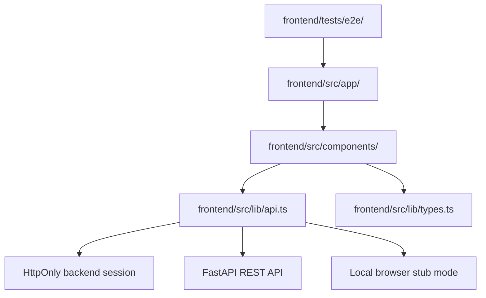
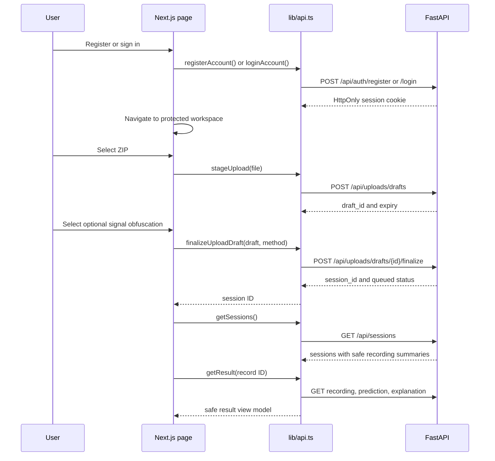
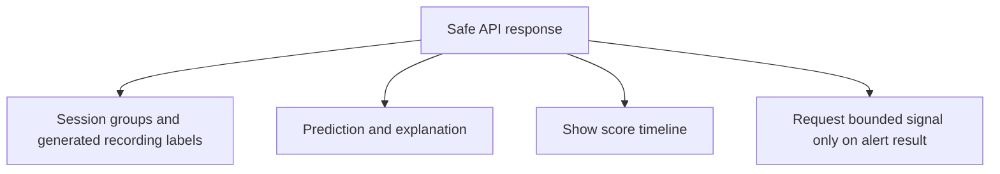

# Frontend internals

Use this after [setup](setup.md) and [architecture](architecture.md). It covers
browser responsibilities and the EEG/video-privacy screens. For the VSViG
workflow and its evidence UI, use [video-detection.md](video-detection.md).

The frontend is a small Next.js App Router application. It owns screens and
browser state; the FastAPI backend owns sessions, processing, and results. The
The dashboard is the workspace home; `/upload` is the shared entry point for one
EEG archive, one separate video, or both.

MDS01 — EEG Research Review is a research workspace for clinicians and clinical
researchers. Its job is to make upload state, privacy handling, and model
output easy to inspect. It does not replace clinical judgment or claim an
autonomous diagnosis.



## User journey

```mermaid
flowchart LR
    Login[/login] --> Auth[Backend session cookie]
    Auth --> Workspace[/dashboard]
    Workspace --> Upload[/upload · EEG, video, or both]
    Upload --> Stage[Encrypt/stage EEG when selected]
    Upload --> Video[Hold video selection until submit]
    Stage --> Config[Configure EEG privacy]
    Video --> Config
    Config --> Submit[Submit selected modalities]
    Submit --> Session[/sessions/{sessionId}]
    Submit --> VideoJob[/video-detection/{jobId}]
    Submit --> Combined[/analysis?sessionId=…&videoJobId=…]
    Session --> Dashboard[/dashboard]
    Dashboard --> Poll[Poll active sessions]
    Session --> Results[/results/{recordId}]
    Config --> Preview[Synthetic before/after preview]
    Results --> Viewer[Optional bounded retained EEG viewer]
    Results --> Timeline[Full score timeline and alert threshold]
    Results --> Prediction[Development score or reviewed model output]
```

## Frontend-to-backend calls



The adapter uses FastAPI by default. Set the explicit stub flag only for local
E2E tests or UI work without a backend:

```dotenv
NEXT_PUBLIC_USE_API_STUB=false
NEXT_PUBLIC_AUTH_MODE=backend
NEXT_PUBLIC_API_BASE_URL=http://127.0.0.1:8000
NEXT_PUBLIC_ENABLE_SIGNAL_PREVIEW=false
NEXT_PUBLIC_ENABLE_FULL_SIGNAL_PREVIEW=false
```

## Pages and components

- `src/app/upload/page.tsx` renders the shared EEG/video upload route.
- `src/app/analysis/page.tsx` renders the paired status/report hand-off.
- `src/app/dashboard/page.tsx` renders session groups and every recording.
- `src/app/sessions/[sessionId]/page.tsx` renders one session’s timestamp and recording list.
- `src/app/results/[recordId]/page.tsx` renders one recording result.
- `src/app/login/page.tsx` renders sign-in and self-registration.
- `src/components/UploadScreen.tsx` owns modality selection, EEG staging, privacy choices, and submission.
- `src/components/CombinedAnalysisScreen.tsx` presents the two existing owner-scoped jobs together.
- `src/components/VideoDetectionScreen.tsx` owns standalone video submission,
  privacy provenance, VSViG score timelines and patch-sensitivity evidence.
- `src/components/DashboardScreen.tsx` owns the workspace home, session grouping, and active-session polling.
- `src/components/SessionDetailScreen.tsx` owns one session’s summary and recording list.
- `src/components/SessionRecordings.tsx` renders safe recording rows and result links.
- `src/components/ResultScreen.tsx` owns session-scoped prediction and explanation review.
- `src/components/RecordingNavigator.tsx` lets a clinician move through every safe recording in the current session.
- `src/components/PredictionTimeline.tsx` renders window scores, the alert threshold, and flagged intervals.
- `src/components/SignalViewer.tsx` requests a bounded retained positive clip only on a model-alert result page.
- `src/components/AppShell.tsx` provides shared navigation and page frame.
- `src/components/LoginScreen.tsx` owns the local account form and actionable errors.
- `src/lib/api.ts` is the only frontend-to-backend adapter.
- `src/lib/types.ts` defines the frontend view-model types.

## Privacy behavior in the UI



The frontend never displays patient references, original filenames, original
paths, unrestricted original files, or waveform samples during upload
configuration. CHB-MIT summary/sidecar intervals are not displayed to normal
users; recording rows and alert states use only model alert windows.
Video detection returns prediction/evidence metadata and an encrypted
owner-scoped privacy-safe review visualization. It never exposes source video or
filesystem paths; the standalone video-privacy screen has its own acknowledgement
and download policy.
The app shell checks `/api/auth/session` before rendering protected pages. It
does not put credentials or auth state in local storage. A `401` from a
protected request returns the user to `/login`; the backend remains the source
of truth.
Development results use amber `Development flag` and `Development score`
wording. A verified calibrated runtime may use red model-alert wording. The
development score is not confidence, accuracy, or a seizure diagnosis. The
result page leads with flagged-window counts and exact alert times; the raw
peak score stays in collapsed technical details.
Completed sessions can be deleted from the dashboard or session detail page;
active sessions stay protected until processing finishes. Signal preview is
disabled unless explicitly enabled for local development and never shows a
non-alert recording.

On an alert result, the full score timeline covers the complete recording and
shows the threshold plus exact model-positive intervals. The EEG viewer draws
all 18 model channels as stacked traces and highlights the exact positive
windows. Normal local preview uses a retained clip with up to 10 minutes of
context before the first alert. A complete transformed recording is available
only when both signal-preview and full-preview flags are enabled. A recording
with no model-positive window shows the score timeline but no EEG viewer, and
no EEG artifact is retained for it. The synthetic before/after privacy preview
exists only on the upload configuration screen.

## Frontend reading order

1. `src/app/layout.tsx` and `src/components/AppShell.tsx` — shared shell.
2. `src/app/upload/page.tsx` and `UploadScreen.tsx` — first user action.
3. `src/app/dashboard/page.tsx` and `DashboardScreen.tsx` — session grouping and polling.
4. `src/app/sessions/[sessionId]/page.tsx` and `SessionDetailScreen.tsx` — session detail.
5. `src/app/results/[recordId]/page.tsx` and `ResultScreen.tsx` — recording result review.
6. `src/lib/types.ts` — view-model contracts.
7. `src/lib/api.ts` — stub/backend switch and API calls.
8. `tests/e2e/mds01.spec.ts` — expected user-visible behavior.

The shared header keeps the existing detailed destinations; the dashboard is the
workspace home and **New analysis** is the single entry point for EEG/video.
Video privacy remains a separate utility. Each screen keeps its primary action
near its heading; model name/version and research-only status remain visible
on results. Technical metadata stays collapsed until needed.

Estimated probabilities refer to four-second windows at two-second strides.
Timeline points sit at window centers; shading preserves their full support.
Only calibrated results use probability language. The recording summary remains
descriptive: counts, window fractions, peak window output and intervals.

The visual rules live in the root [`DESIGN.md`](../DESIGN.md). Keep new visual
work aligned with that file instead of adding another design system.

Patient-video privacy is a separate surface at `/video-privacy`. It uses the
video-privacy API and renders privacy outputs without constructing URLs from
backend storage paths.
