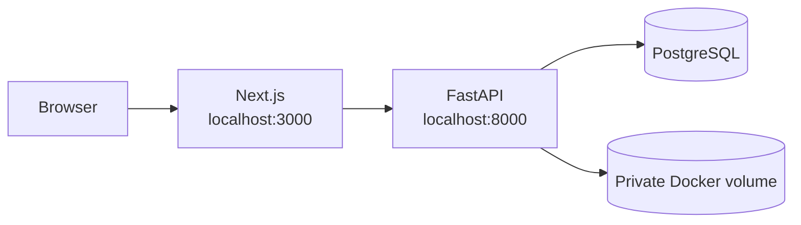
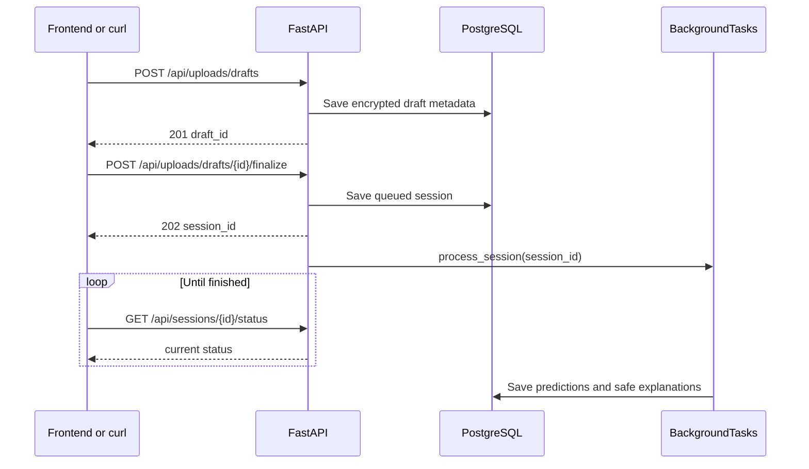

# Run MDS01 locally

MDS01 has two parts: PostgreSQL and FastAPI run in Docker; the Next.js
frontend runs separately during development.



## First run

From the repository root:

If you want to run tests locally or remove editor import warnings, create the
project virtual environment and install the development dependencies:

```bash
python3 -m venv .venv
.venv/bin/python -m pip install -r backend/requirements-dev.txt
```

Docker installs the backend dependencies inside the container, so this local
environment is not required to run the Docker-based API. In VS Code, select
`.venv/bin/python` with **Python: Select Interpreter** so Pylance uses the same
environment as the test commands.

```bash
cp .env.example .env
openssl rand -base64 32
openssl rand -base64 32
```

Put the two different outputs into `.env`:

```dotenv
MDS01_STORAGE_KEY=first-random-value
MDS01_TEMPLATE_KEY=second-random-value
```

`.env.example` is only a safe template. `.env` contains local secrets and is
ignored by Git. The first key encrypts uploaded ZIP files. The second key
controls the experimental signal transformation.

Start PostgreSQL and FastAPI:

```bash
docker compose up --build
```

The Docker backend defaults to the H5 research runtime and builds for
`linux/amd64`, which is compatible with the TensorFlow CPU wheel. On Apple
Silicon this may use emulation and can be slower. To run the lightweight
development stub instead:

```bash
MODEL_RUNTIME=stub INSTALL_RESEARCH=false docker compose up --build
```

The H5 service fails at startup until `backend/model/model-contract.json` has
been verified and explicitly marked reviewed. The contract records the exact
18-channel order, 256 Hz sampling, four-second windows, two-second step,
preprocessing, threshold, output semantics, and artifact hash.

Run the frontend in another terminal:

```bash
cd frontend
npm install
cp .env.example .env.local
npm run dev
```

Open <http://127.0.0.1:3000>. The API and Swagger are at
<http://127.0.0.1:8000> and <http://127.0.0.1:8000/docs>.

## Stop and restart

Stop containers while keeping database data:

```bash
docker compose down
```

Start them again:

```bash
docker compose up
```

Do not use `docker compose down -v` unless you intentionally want to delete
the PostgreSQL Docker volume and its data.

## Useful checks

```bash
curl http://127.0.0.1:8000/health
docker compose ps
docker compose logs backend
docker compose exec backend alembic -c backend/alembic.ini current
```

## Verify and run the H5 artifact

The host virtual environment may not have a compatible TensorFlow wheel on
Apple Silicon or Python 3.13. Run verification inside the research-enabled
Docker image instead:

```bash
docker compose build --no-cache
docker compose run --rm backend python backend/scripts/verify_h5_model.py \
  backend/model/best_seizure_model.h5
```

The verifier performs an actual model load and float32 smoke prediction. It
does not mark the contract reviewed automatically. After independently
reviewing the training preprocessing and threshold, set `reviewed` to `true`
and restart the backend. If verification fails, use the stub explicitly and
do not transpose or reshape the model input to force compatibility.

Run tests from the repository root:

```bash
PYTHONPATH=. .venv/bin/python -m unittest discover -s backend/tests -v
PYTHONPATH=. .venv/bin/python -m compileall -q backend
cd frontend && npm run lint && npm run build && npm run test:e2e
```

`npm run test:e2e` is the fast stub-based browser suite. To exercise the real
Next.js → FastAPI → PostgreSQL workflow with a synthetic privacy-canary EDF:

```bash
cd frontend
npm run test:e2e:real
```

This starts the disposable Compose project `mds01-security` on backend port
`18000`, runs one real workflow, and removes only that project's test volumes.
It requires Docker and the repository `.venv`. See
[the security audit](security-audit.md) for scope and remaining deployment work.

## Video privacy workflow

Open <http://127.0.0.1:3000/video-privacy> and select one profile:

- `Face redaction` uses OpenCV detection and blur. The surrounding scene stays
  visible, but intermittent detection is surfaced as a quality caveat.
- `Pose-only` renders MediaPipe landmarks on a non-identifying background. It
  never previews the original scene.

The backend accepts MP4, MOV, and WebM uploads, removes audio by writing a new
video stream, and stores encrypted output under an opaque `VID-…` job. The
original and transient plaintext files are removed after processing. A
`Needs review` result is downloadable only after the reviewer acknowledges the
quality caveat. This is a research privacy transform, not a guarantee of
anonymity. Keep real patient videos outside the repository and use a short,
consented synthetic clip for local tests.

## Authentication modes

Local Docker uses `APP_ENV=development` and `AUTH_MODE=local`. Its API and
database ports bind to `127.0.0.1`, so they are available only from this
computer.

Before exposing the app to teammates, place it behind Cloudflare Access and
configure the backend with:

```dotenv
APP_ENV=production
AUTH_MODE=cloudflare
CLOUDFLARE_ACCESS_TEAM_DOMAIN=your-team.cloudflareaccess.com
CLOUDFLARE_ACCESS_AUD=your-access-application-audience
```

The team domain is a hostname only—do not include `https://` or a trailing
slash. Cloudflare secrets and Access tokens must never use a `NEXT_PUBLIC_`
frontend variable.

## How an upload is tested

Use the Swagger page, or stage a ZIP with curl:

```bash
curl -F 'archive=@recordings.zip' \
  http://127.0.0.1:8000/api/uploads/drafts
```

The response is `201` with an opaque `draft_id`. Select a privacy method only
after staging, then finalize the draft:

```bash
curl -X POST \
  -F 'privacy_methods=["metadata-scrub"]' \
  http://127.0.0.1:8000/api/uploads/drafts/UPL-.../finalize
```

Finalization returns `202` with a session ID. The frontend then polls the
session while FastAPI's in-process `BackgroundTasks` runs the pipeline. The
older `POST /api/sessions/upload` remains available for compatibility and
accepts either the legacy `privacy_method` field or the new ordered
`privacy_methods` field. Use
`["metadata-scrub", "signal-obfuscation"]` to apply both. Metadata scrub and
encrypted storage are always enabled; omitting signal obfuscation means no
additional signal transformation.



BackgroundTasks is suitable for this prototype. A process restart can interrupt
a running task; Redis/RQ can be added later if durable retries or multiple
workers become necessary.

## Common problems

- Upload fails with a missing-key error: fill both key values in `.env` and
  restart Docker.
- API is unavailable: run `docker compose ps` and inspect
  `docker compose logs backend`.
- Frontend cannot call the API: use `NEXT_PUBLIC_USE_API_STUB=false` and make
  sure the backend is running on port 8000.
- Migration errors: inspect `docker compose logs backend`; the container runs
  `alembic upgrade head` before starting FastAPI.
- Waveform endpoint returns `404`: this is expected unless both
  `ENABLE_SIGNAL_PREVIEW=true` in the backend and
  `NEXT_PUBLIC_ENABLE_SIGNAL_PREVIEW=true` in the frontend. Even when enabled,
  only retained model-positive transformed data can be viewed. A complete
  transformed recording requires both full-preview flags and must remain a
  local-development setting: `ENABLE_FULL_SIGNAL_PREVIEW=true` and
  `NEXT_PUBLIC_ENABLE_FULL_SIGNAL_PREVIEW=true`.
