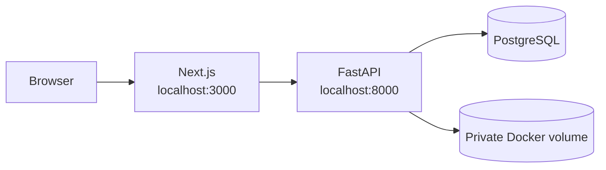
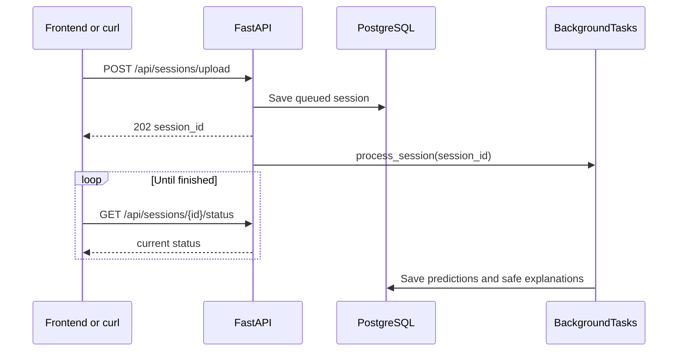

# Run MDS01 locally

MDS01 has two parts: PostgreSQL and FastAPI run in Docker; the Next.js
frontend runs separately during development.



## First run

From the repository root:

If you want to run tests locally or remove editor import warnings, create the
project virtual environment and install the development dependencies:

```bash
python3 -m venv .venv
.venv/bin/python -m pip install -r backend/requirements-dev.txt
```

Docker installs the backend dependencies inside the container, so this local
environment is not required to run the Docker-based API. In VS Code, select
`.venv/bin/python` with **Python: Select Interpreter** so Pylance uses the same
environment as the test commands.

```bash
cp .env.example .env
openssl rand -base64 32
openssl rand -base64 32
```

Put the two different outputs into `.env`:

```dotenv
MDS01_STORAGE_KEY=first-random-value
MDS01_TEMPLATE_KEY=second-random-value
```

`.env.example` is only a safe template. `.env` contains local secrets and is
ignored by Git. The first key encrypts uploaded ZIP files. The second key
controls the experimental signal transformation.

Start PostgreSQL and FastAPI:

```bash
docker compose up --build
```

Run the frontend in another terminal:

```bash
cd frontend
npm install
cp .env.example .env.local
npm run dev
```

Open <http://127.0.0.1:3000>. The API and Swagger are at
<http://127.0.0.1:8000> and <http://127.0.0.1:8000/docs>.

## Stop and restart

Stop containers while keeping database data:

```bash
docker compose down
```

Start them again:

```bash
docker compose up
```

Do not use `docker compose down -v` unless you intentionally want to delete
the PostgreSQL Docker volume and its data.

## Useful checks

```bash
curl http://127.0.0.1:8000/health
docker compose ps
docker compose logs backend
docker compose exec backend alembic -c backend/alembic.ini current
```

Run tests from the repository root:

```bash
PYTHONPATH=. .venv/bin/python -m unittest discover -s backend/tests -v
PYTHONPATH=. .venv/bin/python -m compileall -q backend
cd frontend && npm run lint && npm run build && npm run test:e2e
```

## How an upload is tested

Use the Swagger page, or send a ZIP with curl:

```bash
curl -F 'archive=@recordings.zip' \
  -F 'privacy_method=control' \
  http://127.0.0.1:8000/api/sessions/upload
```

The response is `202` with a session ID. The frontend then polls the status
endpoint while FastAPI's in-process `BackgroundTasks` runs the pipeline.



BackgroundTasks is suitable for this prototype. A process restart can interrupt
a running task; Redis/RQ can be added later if durable retries or multiple
workers become necessary.

## Common problems

- Upload fails with a missing-key error: fill both key values in `.env` and
  restart Docker.
- API is unavailable: run `docker compose ps` and inspect
  `docker compose logs backend`.
- Frontend cannot call the API: use `NEXT_PUBLIC_USE_API_STUB=false` and make
  sure the backend is running on port 8000.
- Migration errors: inspect `docker compose logs backend`; the container runs
  `alembic upgrade head` before starting FastAPI.
- Waveform endpoint returns `404`: this is expected unless
  `ENABLE_SIGNAL_PREVIEW=true` is set for local development.
