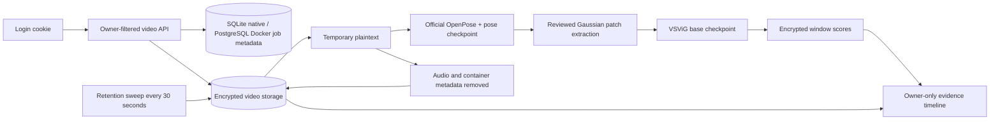

# Video seizure detection

This feature lives on `feat/video-seizure-vsvig`. EEG processing and the existing video privacy workflow are independent. Video detection uses the signed-in account's ownership ID, encrypted storage, and a CPU subprocess. The UI is at `/video-detection`.

## Current readiness

The web/API workflow can be tested without patient data. Real inference requires **both official checkpoints and a reviewed preprocessing contract**. No clinical performance has been established on HUKM data. Annotations are not required to execute inference; onset/offset labels are required to evaluate accuracy or detection latency.

The [official source](https://github.com/xuyankun/VSViG/tree/1026e7e7f2287b96f3cc375830f2836ffdf4588e) provides the base network, weights and patch extraction, but not a complete runnable inference pipeline. Its training script contains placeholder paths, describes two coordinate features while `Stem_pe` requires three, and has differing patch/keypoint order conventions. Frame sampling, coordinate normalization and the checkpoint's exact preprocessing must be confirmed with training evidence or the authors. Do not mark the contract reviewed just to bypass this gate.

The implemented adapter supports the published base architecture, 30 frames, 15 RGB/BGR patches of 32×32 pixels, and three positional features `(x, y, confidence)`. This supported convention is **not claimed to be the checkpoint's validated training convention**. If review establishes another convention, update the adapter and its tests first. Missing people, multiple people, missing landmarks, nonfinite patches, variable frame timing, geometry mismatch and incompatible checkpoints fail the job. The first version is deliberately limited to single-patient clips with complete poses; staff entering the frame or bedding occlusion can prevent inference.

## Laptop setup

The normal stack can run natively with SQLite, but the official VSViG runtime is
the dependency-heavy path. Use native mode for the API, privacy workflow and
stub demos; use the Docker overlay when the host cannot install the pinned
PyTorch/MediaPipe/OpenPose dependencies.

For the native prototype:

```sh
python3.12 -m venv .venv
.venv/bin/python -m pip install -r backend/requirements-dev.txt
node scripts/start-native.mjs
```

For the reproducible VSViG runtime, install Docker Desktop and Node.js 22+ with npm. Run the normal setup first:

```sh
node scripts/setup.mjs
docker compose build backend
```

Supply this bundle **outside Git**, from trusted official releases/source checkouts. The application never downloads weights or patient data:

```text
external-model-bundle/
  contract.json
  VSViG-base.pth
  pose.pth
  dy_point_order.pt
  vsvig/
    VSViG.py
    extract_patches.py
    LICENSE
  openpose/
    demo.py
    val.py
    models/...
    modules/...
    LICENSE
```

VSViG source is pinned to commit `1026e7e7f2287b96f3cc375830f2836ffdf4588e`; the two executable VSViG source files also have pinned SHA-256 hashes in the adapter. Supply the official [lightweight OpenPose implementation](https://github.com/Daniil-Osokin/lightweight-human-pose-estimation.pytorch) used by `pose.pth`, and retain its license. Every mounted Python file and checkpoint must have a manifest hash. Record the OpenPose source revision in the contract review reference. Never approve an arbitrary downloaded Python file merely because its hash was computed locally.

Add absolute paths to the existing ignored `.env` (Windows Docker Desktop also accepts an absolute host folder path):

```dotenv
VSVIG_ASSET_DIR=/absolute/path/to/external-model-bundle
VIDEO_DATA_DIR=/absolute/path/to/approved-videos
```

Generate an **unreviewed** manifest template on stdout; save it as `contract.json` in the external bundle, outside this repository:

```sh
docker compose -f docker-compose.yml -f docker-compose.video-detection.yml run --rm --no-deps backend python -m backend.scripts.video_contract /opt/vsvig
```

The runtime image must be built before the command above on a fresh machine:

```sh
docker compose -f docker-compose.yml -f docker-compose.video-detection.yml build backend
```

Fill the null fields only from reviewed checkpoint preprocessing evidence. `patch_order` and `keypoint_order` are explicit, unique 15-element index lists referencing the 18 OpenPose joints; `pixel_scale` multiplies extracted patch values; `coordinate_scale` multiplies x/y coordinates; `sample_fps`, `stride_frames`, `pose_height`, exact video `width`/`height`, `color_order` and `min_keypoint_score` are explicit. Set `third_feature` to `confidence` only when that convention is verified. Record a stable version and review reference, then set `reviewed` to true. The provisional threshold is 0.5 and remains a research setting.

Start the stack:

```sh
docker compose -f docker-compose.yml -f docker-compose.video-detection.yml up --build
```

In another terminal:

```sh
cd frontend
npm ci
npm run dev
```

Open `http://127.0.0.1:3000`, register/sign in, and select **Video detection**. Use the same hostname for frontend and API; cookies are required for video playback. Video inference is CPU-only in this pass and may take substantially longer than the clip duration on Docker Desktop. One video job runs at a time, with a one-hour execution ceiling bounded by retention. There is no real-time latency claim.

## Inventory before uploads

```sh
docker compose -f docker-compose.yml -f docker-compose.video-detection.yml exec backend python -m backend.scripts.video_inventory /private-video-data
```

This command prints aggregate counts, durations, frame rates and resolutions without filenames, paths or file contents. It identifies possible annotation files by extension only; it does not validate labels. Empty/unreadable input exits with code 2. MP4, MOV and WebM are accepted by the app; other formats require a separately reviewed conversion. The last inspected patient folder had no videos; inventory it again when data arrives.

## Architecture and data handling



FastAPI routes remain thin; persistence is in the dedicated repository, processing in the video detection service, and model code in the video detection adapter. Migration 015 creates an independent table with a mandatory account owner. The frontend shares the existing transport, session expiry handling, buttons and design tokens.

Endpoints are `POST /api/video-detection/jobs`, `GET /api/video-detection/jobs`, and `GET /api/video-detection/jobs/{job_id}` with `/predictions` and `/video` subresources. Upload takes multipart `video`; there is no patient name or filesystem path field. Unauthorized ownership returns 404. Unauthenticated requests return 401, including unauthenticated test mode. Missing or unreviewed assets return 503 before input is retained; unsupported input returns 422. A busy processor returns 409.

Jobs move through queued, processing, ready, failed or expired. Scores carry checkpoint hashes, model version, preprocessing version and threshold. Adjacent/overlapping positive window supports merge into event intervals. Raw sigmoid scores remain uncalibrated model scores. `recording_probability_available` stays false. The timeline positions points at window centers and the table preserves exact supports.

Source appearance is retained for the explicitly requested private review. Playback strips audio, container metadata, chapters, subtitles and attachments but does **not** remove identifiers burned into pixels. Patient appearance therefore remains sensitive. No raw video URL bypasses ownership checks. Range requests are authenticated; decrypted response files are removed in `finally`, including unsuccessful responses. API/browser responses use `Cache-Control: no-store`.

After processing, the encrypted upload and temporary files are removed; encrypted review video and results remain for `VIDEO_RETENTION_SECONDS` (default 24 hours). A background sweep deletes expired artifacts within 30 seconds while the backend is running. Access after expiry is denied immediately. Restart clears interrupted jobs and leftover playback plaintext. While the laptop/backend is off, physical deletion resumes on startup; do not describe retention as an always-running external deletion guarantee.

No Docker or Git history is rewritten. Existing Postgres volumes keep their current database password; removing a Compose fallback does not rotate a database credential. Do not change an existing `.env` password without coordinating its database password rotation. New installations receive random credentials through setup.

## HUKM handoff checklist

- Confirm approved retrospective use, permitted users, retention and whether source appearance can be reviewed locally.
- Record camera angle/height, bed framing, resolution, frame rate, visible people, lighting/infrared mode and common occlusions.
- Confirm audio policy and remove audio from review exports.
- Obtain pseudonymous clip IDs and clinician-reviewed onset/offset labels. Keep the identity key at HUKM.
- Distinguish EEG onset from visible clinical onset; document timestamps, timezone, clock offsets and drift when preparing evaluation labels.
- Include positive events and representative negative clips; keep patient-disjoint evaluation sets.
- Report event sensitivity, false alarms per hour and onset latency only when annotations and sample coverage justify them.

## Checks

```sh
docker compose exec -e AUTH_MODE=local -e MODEL_RUNTIME=stub -e VIDEO_DETECTION_ENABLED=false backend python -m unittest discover -s backend/tests
cd frontend
npm run lint
npm run build
npm run test:e2e -- video-detection.spec.ts
npm run test:e2e:real
```

Unit/browser tests use synthetic media or explicitly injected results. They validate application behavior, not VSViG accuracy. Real model verification is separate and must use the reviewed mounted bundle and approved videos. Record failures honestly; no stub fallback is available for patient video detection.
