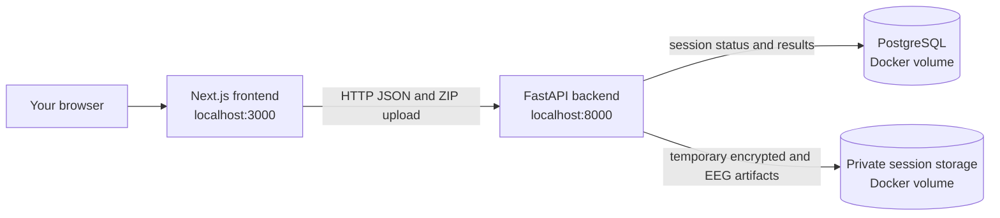
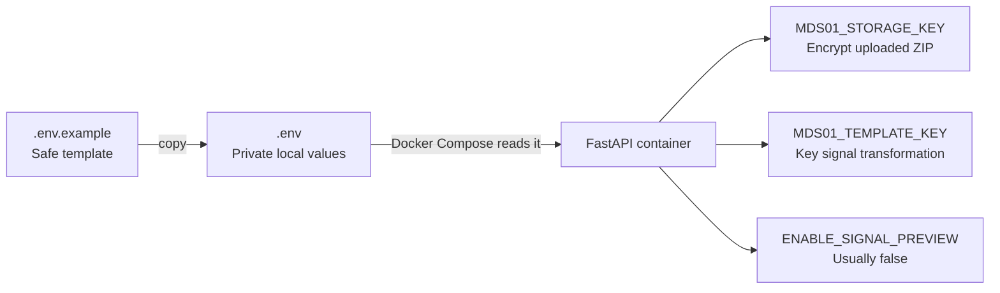
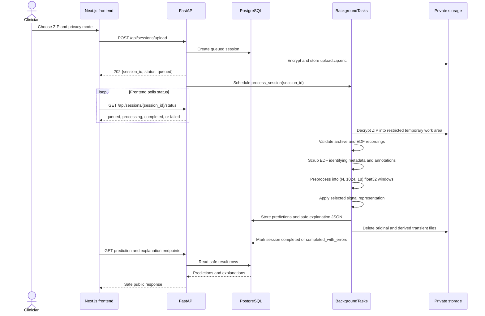
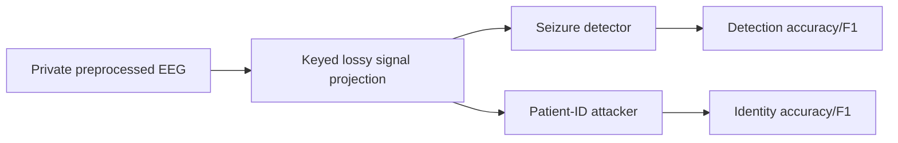
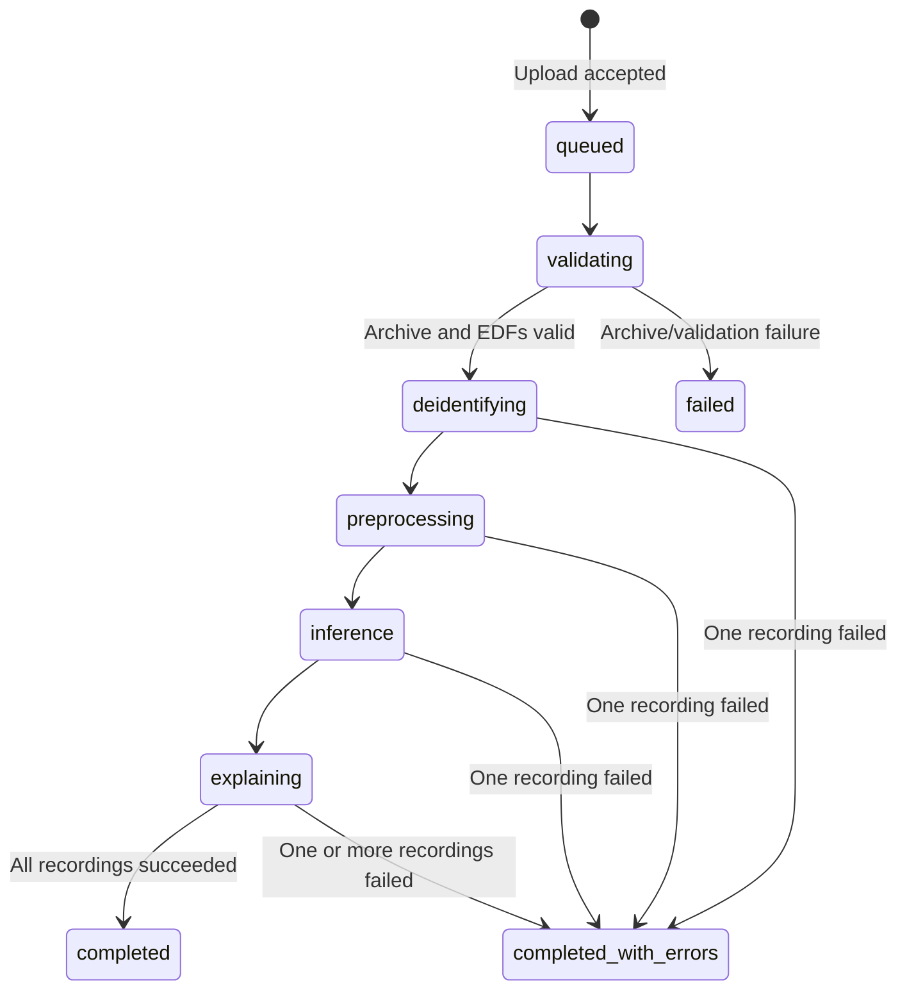
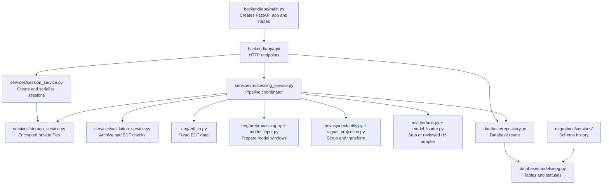
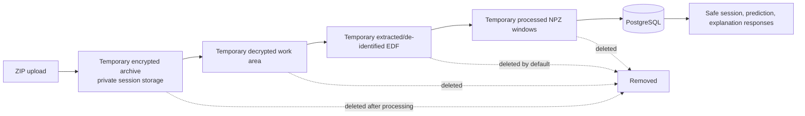

# MDS01 workflow for a new contributor

This page explains the repository from the outside in. You do not need to
understand EEG or Docker before reading it.

## 1. The three things you run

There are three important processes during local development:



Start the backend services from the repository root:

```bash
cp .env.example .env
# Fill in MDS01_STORAGE_KEY and MDS01_TEMPLATE_KEY in .env.
docker compose up --build
```

Start the frontend in another terminal:

```bash
cd frontend
npm install
cp .env.example .env.local
npm run dev
```

Then use:

- Frontend: <http://127.0.0.1:3000>
- API: <http://127.0.0.1:8000>
- Swagger API explorer: <http://127.0.0.1:8000/docs>

Docker Compose starts PostgreSQL and FastAPI. It does not start the Next.js
frontend; you run that separately so frontend development stays quick.

## 2. What `.env` does

`.env.example` is only a committed list of required configuration names. Copy
it to `.env` and put the real local values there:



The keys are not usernames or passwords. They are random cryptographic keys.
Generate two different ones with:

```bash
openssl rand -base64 32
openssl rand -base64 32
```

Never commit `.env`. The example file is safe to commit; the real file is
ignored by Git.

## 3. Upload-to-result workflow

The frontend sends one ZIP archive and one privacy method. The API responds
quickly with `202` while FastAPI continues the work in a background task.



## 4. The processing pipeline

Every EDF is processed independently. If one EDF is malformed, its recording
is marked failed and sibling recordings continue.

```mermaid
flowchart TD
    Upload[Encrypted ZIP upload] --> Archive[Validate ZIP paths, size, and EDF count]
    Archive --> Extract[Temporary EDF extraction]
    Extract --> Each{For each EDF}
    Each --> Validate[Validate EDF header, channels, rate, duration]
    Validate -->|invalid| RecordError[Mark only this recording failed]
    Validate -->|valid| Scrub[De-identify EDF metadata and free-text annotations]
    Scrub --> Prep[Filter, notch, normalize, clip]
    Prep --> Windows[(N, 1024, 18) float32 windows]
    Windows --> Mode{Privacy method}
    Mode --> Control[control\nUse preprocessed windows]
    Mode --> Projection[cancellable-signal-projection\nKeyed lossy projection + quantization]
    Control --> Detector[Inference adapter]
    Projection --> Detector
    Control --> AttackerFeatures[PSD features for identity evaluation]
    Projection --> AttackerFeatures
    Detector --> Predictions[Window predictions in PostgreSQL]
    AttackerFeatures --> Attacker[Offline identity attacker\nCHB-MIT evaluation only]
    Predictions --> Explain[Non-clinical explanation JSON]
    Explain --> Results[Safe API results]
    RecordError --> Results
```

The important research rule is that the projection branch does not bypass the
detector. The same transformed windows go to both downstream branches:



The current `development-stub` is deterministic and explicitly non-clinical.
The H5 model is blocked until its input, output, threshold, and training
preprocessing contract have been reviewed.

## 5. Session states

The session status is stored in PostgreSQL. The frontend uses it to show
progress.



## 6. Where to look in the code

Read the code in this order:



Supporting folders:

- `frontend/src/app/`: browser pages such as upload, dashboard, and results.
- `frontend/src/components/`: visual components used by those pages.
- `frontend/src/lib/api.ts`: frontend-to-FastAPI adapter and stub mode.
- `backend/tests/`: backend validation, privacy, pipeline, and API tests.
- `backend/scripts/inspect_edf.py`: inspect a local EDF while learning.
- `backend/scripts/explore_chb_mit.py`: inspect the research dataset.
- `backend/scripts/evaluate_chb_mit.py`: aggregate utility/privacy evaluation.
- `backend/scripts/verify_h5_model.py`: create a contract for manual H5 review.

## 7. What is stored where



PostgreSQL stores session status, recording summaries, processing attempts,
predictions, and safe explanation JSON. It must not store EEG binaries.

The public API never returns patient references, original filenames, original
paths, cryptographic hashes, or original EEG files. Signal preview is disabled
unless `ENABLE_SIGNAL_PREVIEW=true` is explicitly used for local development.

## 8. The shortest useful mental model

```text
Frontend = screen and user actions
FastAPI = HTTP boundary
BackgroundTasks = starts the long EEG job in this prototype
Services = business workflow
Privacy = scrub metadata and transform signal
ML adapter = stub now, reviewed model later
PostgreSQL = status and safe results
Private storage = temporary EEG files
Alembic = database schema history
```
